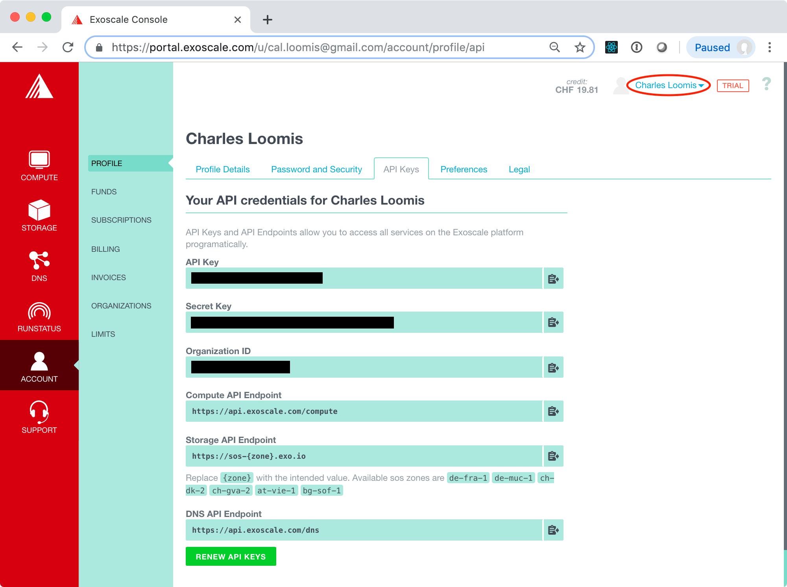

# Exercises CLI Exoscale

Exoscale provides a comprehensive Command Line Interface (CLI) for
their services. CLIs are often useful for quick scripting tasks that
automate some actions on the cloud.

An [Exoscale blog
post](https://community.exoscale.com/documentation/tools/exoscale-command-line-interface/)
covers basic installation and use of the CLI. 

## Installation

The process for all platforms is similar. Essentially, the process
consists of:

 - Download the package for your machine from the [Exoscale CLI
   releases](https://github.com/exoscale/cli/releases) on GitHub.

 - Install or unpack the package and ensure that it is available in
   your shell's `PATH`.

These are binary packages that depend on the operating system.  Be
sure to use the correct package. If you're on macOS, Homebrew can be
used instead of directly downloading a release.

To verify that the command line has been properly installed, run the
command:

```
$ exo version

exo 1.4.1 ad5f7a1 (egoscale 0.18.1)
```

As above, it should respond with the version number of the installed
CLI. To get detailed help, use the command `exo help`.

## Configuration

The Exoscale CLI must be configured with your API key and
secret. These values can be recovered from the Exoscale portal.

Log into the Exoscale portal and then navigate to the
"ACCOUNT/PROFILE" page. Near the top of that page, there will be an
"API Keys" tab. When you select that tab it should look like the
following screenshot.



## Compute Lifecycle

