# Exercises

These exercises will help you understand the core features of an
Infrastructure as a Service (IaaS) cloud infrastructure. Although
nearly all IaaS cloud infrastructures have the same core features,
details differ between them.

To avoid getting bogged down in the differences, the descriptions
below presume that you are using the [Exoscale](https://exoscale.com)
service. This service originally started in Switzerland and has since
expanded to Germany and Austria. It focuses on the European market and
prides itself on providing robust services at a competitive price.

## Exoscale Account

You will have been given a coupon code for 20 CHF of computing
resources on Exoscale. When registering an account with this code,
**you will not need to provide a credit card or your own funds**.

With a web browser visit the URL:

```
https://portal.exoscale.ch/register?coupon=COUPON_CODE
```

replacing `COUPON_CODE` with the actual code from your coupon. You
should see a page similar to the following screenshot:

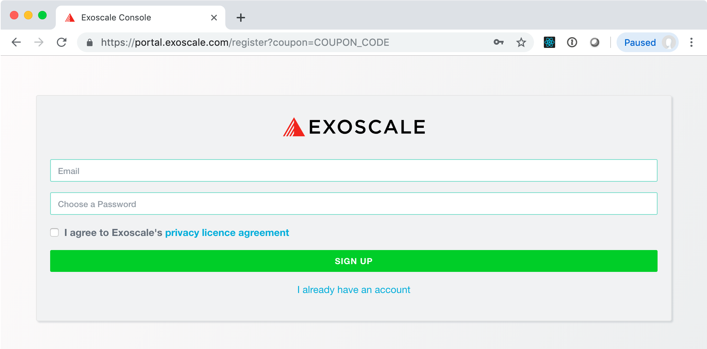

After filling in the form and clicking on the button, you should then
see a success page that tells you to look for a validation email.

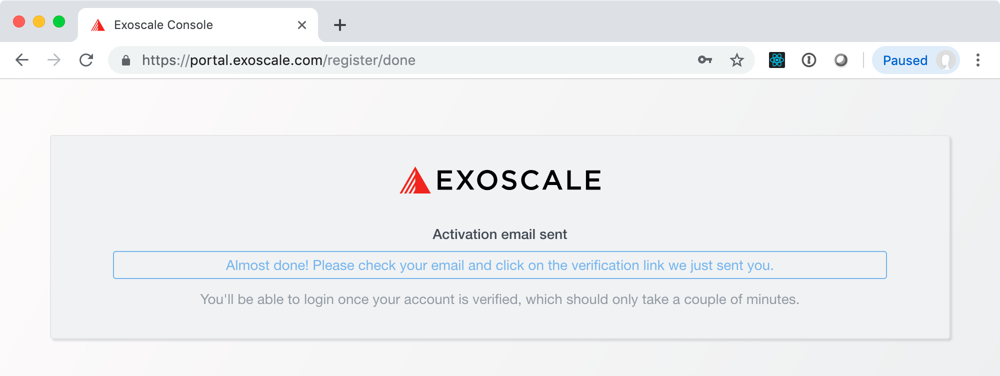

The validation email contains a link for completing the registration
process:

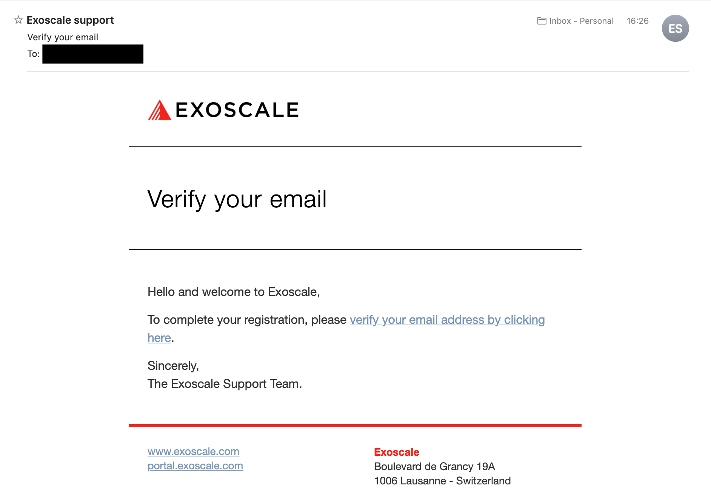

This will then bring up another form that will ask for some personal
information. In this form, you should select **"for personal
projects"**, fill in your name and address, and agree to Exoscale's
terms of service.


At the bottom of this form you should see a reference to the coupon
code that you used.  If this is not there, you can complete the
registration process, but you might have to contact Exoscale support
to add the credit from your coupon.

When you click on the "complete registration" button, you will be
logged in and redirected to the Exoscale portal. Your account will be
marked as a "trial" account until you add you own funds.

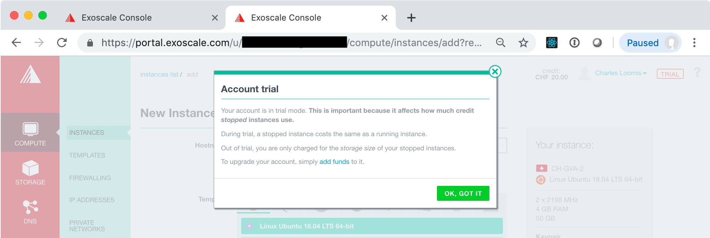

> **NOTE**: The initial free credit will probably not be sufficient to
> run all the exercises in this course.  When your funds run out, send
> an email to the instructor who will add you to an Exoscale
> organization that has more funds.

## Compute Lifecycle

Being able to manage the full lifecycle of virtual machines is the
primary feature of any IaaS cloud service. These exercises will show
you how to start, access, stop, and destroy a virtual machine on the
Exoscale cloud.

### Create a VM

Log into the [Exoscale portal](https://portal.exoscale.com/) with your
browser, if you are not already.

In the portal, go to the `COMPUTE/INSTANCES` tab. You will likely land
here if you're just logging into the portal.

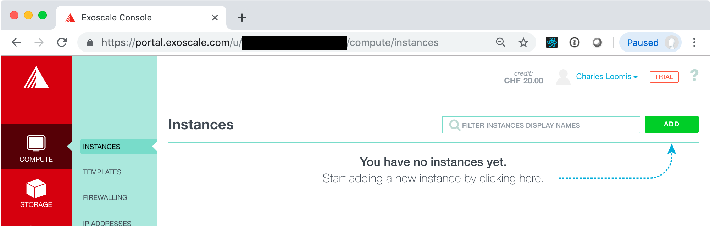

On this page, click on the "ADD" button to bring up a form to select
the type of virtual machine you want to deploy.

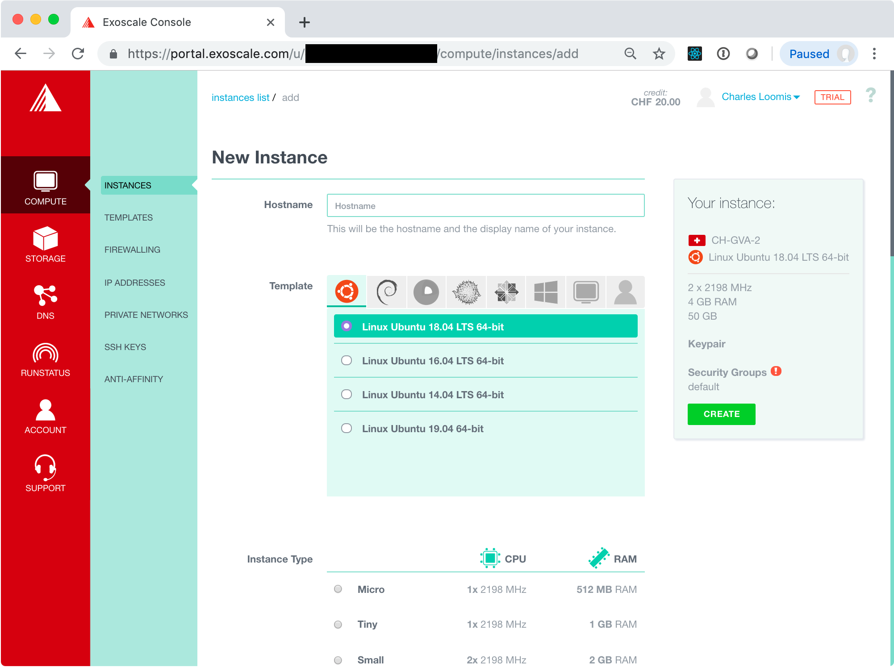

In this form, provide the configuration for the virtual machine you
want to deploy:

 - **Hostname**: choose a descriptive name for your machine,
   e.g. "exercise1". The inline help will guide you to a valid value.
   
 - **Template**: the operating system to use, e.g. Linux Ubuntu
   18.04. Choose any Linux operating system with which you are
   confortable. Ubuntu and CentOS are common choices.
   
 - **Instance Type**: describes the number of vCPUs and amount of RAM,
   e.g. Tiny. Larger machines are more expensive.
   
 - **Disk**: size of the disk to attach to the virtual machine,
   e.g. 10 GB. Note: this disk space is **not** persistent!

 - **Zone**: the Exoscale data center to use, e.g. CH-GVA-2. Any zone
   should work.

Ignore the other field in the form for now.  Later in the exercises
you will deal with configuring the security groups and logging into
the machine with SSH.

Once you are happy with the machine configuration, click on the
"CREATE" button on the right hand side of the page. This will create
your virtual machine and redirect you to a page with the details.

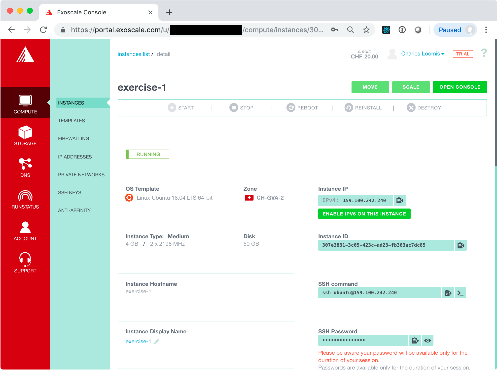

The instance will initially be in the "STOPPED" state, but should
quickly become "RUNNING".

### Access VM via Console

Once it is running, you can access the machine via the console.

> **WARNING**: Using the console to access the machine is not
> recommended as a regular practice. Exercises below will show you how
> to access the machine via SSH.

To open the console, click on the "OPEN CONSOLE" button in the
upper-left corner. This will open another window with a web-based
console application. (If you've blocked pop-ups or new windows in your
browser, you'll need to change your browser configuration.)

From the detail page, you can find the user name to use in the SSH
command line.  In the example above, this is "ubuntu".  You can also
click on the "eye" icon in the SSH Password field to see the password
to use. You will probably have to type the password, as copy/paste
into the console may not work.

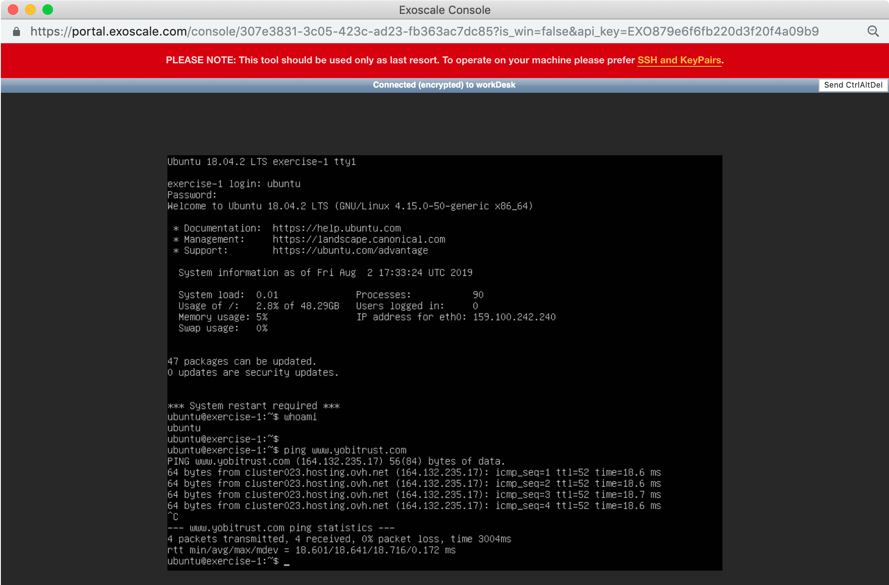

Type a few commands to be sure that the machine is working
correctly. For example, use `whoami` to see the current username or
`ping www.yobitrust.com` to be sure that you can access the Internet
from the VM.

Create a simple text file:

```
echo hello-tunisia > myfile.txt
ls myfile.txt
cat myfile.txt
```

This shows that the file was created and contains the string
"hello-tunisia".  We'll check the contents of this file again below.

### Stop a VM

From the detail page, you can stop the virtual machine. Click on the
"STOP" button in the action bar at the top and confirm the action with
a second click.

Once the machine is in the "STOPPED" state, the console should
disconnect. The machine is no longer running; however, the disk and
any data it contains has been saved.  The machine can be restarted
from a "STOPPED" state.

### Restart a VM

Click on the "START" button in the action bar. The VM should
eventually end up back in the "RUNNING" state. Once this is the case,
close the old console and open a new one.  Log in again and be sure
that the file you created earlier is still there.

```
cat myfile.txt
```

Does this contain the string "hello-tunisia"? 

### Destroying a VM

To complete destroy a VM and free all the associated resources
(including data on the attached disk), click on the "DESTROY" button
in the action bar and click a second time to confirm.

This will start the process to destroy the VM.  You will be directed
back to the instance list page. The VM you created should disappear
from the list once it has been completely cleaned up.

## SSH Configuration

In the previous exercise, you deployed a VM and then accessed it via
a web-based console. As mentioned earlier, this is **not** recommended
for regular use. Instead you should use SSH key pairs to access the
VMs that you deploy.

### Create SSH Key Pair

If you have an existing SSH key pair, you do not need to create a new
one. Just use the one that you have. 

If you do not have an SSH key pair already, then you will need to
create one. A new key pair can be created easily from the command line
on any machine that has SSH installed. Virtually all Linux operating
systems have SSH installed by default.  It is also available by
default on macOS.

Assuming that SSH is installed on your machine, open a terminal and
execute the following command:

```
ssh-keygen
```

You can then respond interactively to the prompts to generate your
key. 

```
Generating public/private rsa key pair.
Enter file in which to save the key (~/.ssh/id_rsa):
Enter passphrase (empty for no passphrase): 
Enter same passphrase again: 
Your identification has been saved in ~/.ssh/id_rsa_test.
Your public key has been saved in ~/.ssh/id_rsa_test.pub.
The key fingerprint is:
SHA256:LcG3FnpclJh2zQBODXDH1vCCxHBVQ9/WmF7hnXMg/TY loomis@Macintosh-3.local
The key's randomart image is:
+---[RSA 2048]----+
|        o+BOB@=. |
|       . *=+*o***|
|        o.=oo +=O|
|         * + o E=|
|        S *   ...|
|         +       |
|                 |
|                 |
|                 |
+----[SHA256]-----+
```

In the output above, the default location for the key has been used
(`${HOME}/.ssh/id_rsa`) and no passphrase was used.  If you provide a
passphrase, you'll need to provide it everytime you use the key. This
is generally annoying, but can be made easier with `ssh-agent`.

### Upload Public Key to Exoscale

Log into the Exoscale portal and then go to the `COMPUTE/SSH KEYS`
tab. If you've not yet registered an SSH key, then the page will look
like the following:

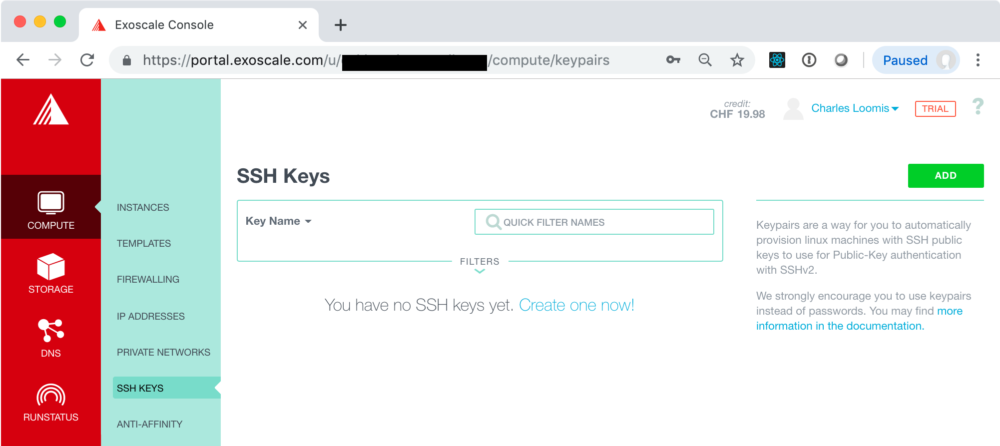

Click on the "Create one now!" link or the "ADD" button.  This will
bring up a form where you can import the key you have just
created. Make sure that the import tab is selected and then fill in
the fields.

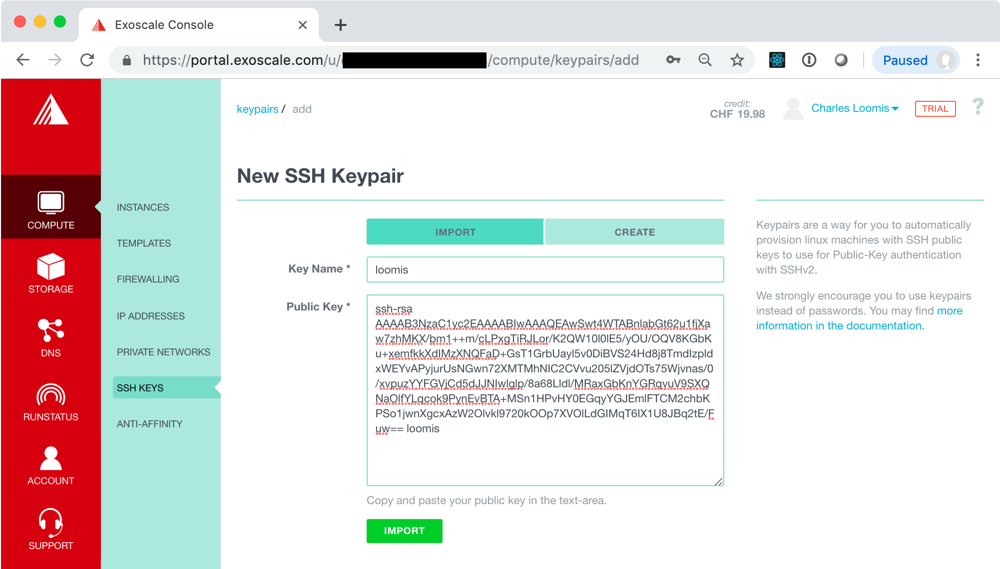

Click the "IMPORT" button. This should redirect you to a page with a
list of SSH keys, which should now contain the one you just
imported. **You should also click on the link "Set as default" to
add this key to all your VMs automatically.**

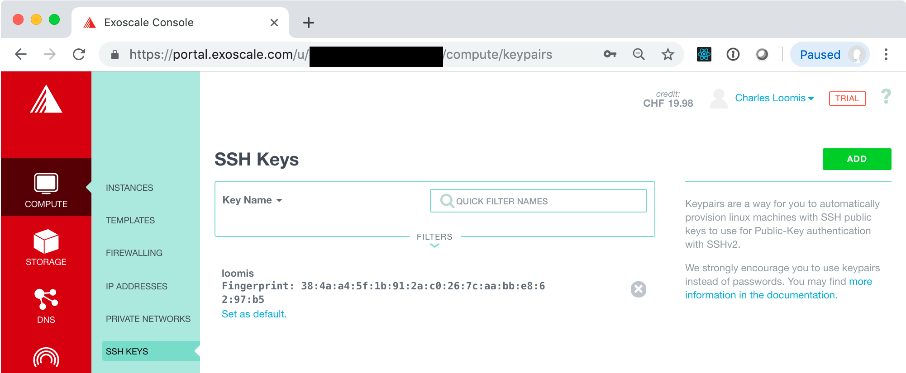

> **NOTE**: You can also generate a key pair directly through the
> portal. Make sure you have the private key when it is presented. You
> will also need to recover the public key so it can be used from
> other machines.  

## Compute Lifecycle (Revisited)

In this exercise, you will revisit the compute lifecycle. This time
you will add the SSH key configuration to your VM and access the
deployed instance with SSH.

In the process of doing this, you will also learn about security
groups and how they affect access to your VMs.


## Storage Lifecycle

## Cloud Applications
