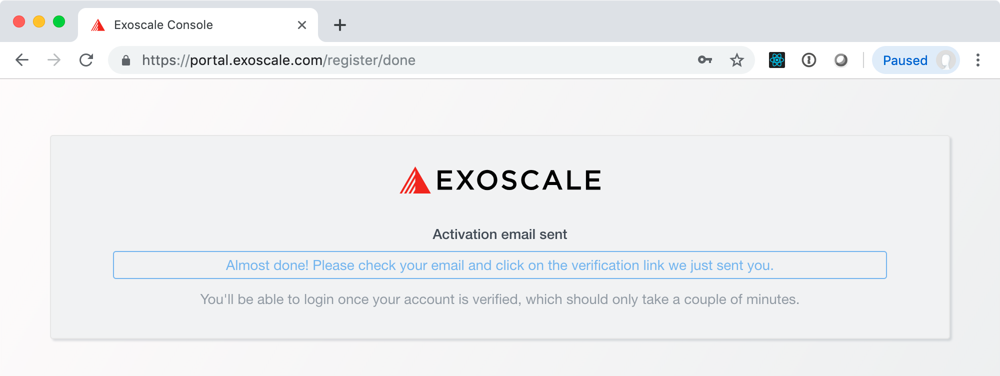
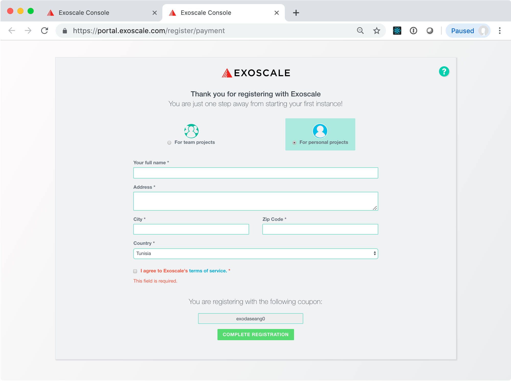

# Exoscale Account

You will have been given a coupon code for 20 CHF of computing
resources on Exoscale. When registering an account with this code,
**you will not need to provide a credit card or your own funds**.

With a web browser visit the URL:

```
https://portal.exoscale.ch/register?coupon=COUPON_CODE
```

replacing `COUPON_CODE` with the actual code from your coupon. You
should see a page similar to the following screenshot:


After filling in the form and clicking on the button, you should then
see a success page that tells you to look for a validation email.



The validation email contains a link for completing the registration
process:


This will then bring up another form that will ask for some personal
information. In this form, you should select **"for personal
projects"**, fill in your name and address, and agree to Exoscale's
terms of service.



At the bottom of this form you should see a reference to the coupon
code that you used.  If this is not there, you can complete the
registration process, but you might have to contact Exoscale support
to add the credit from your coupon.

When you click on the "complete registration" button, you will be
logged in and redirected to the Exoscale portal. Your account will be
marked as a "trial" account until you add you own funds.


> **NOTE**: The initial free credit will probably not be sufficient to
> run all the exercises in this course.  When your funds run out, send
> an email to the instructor who will add you to an Exoscale
> organization that has more funds.
