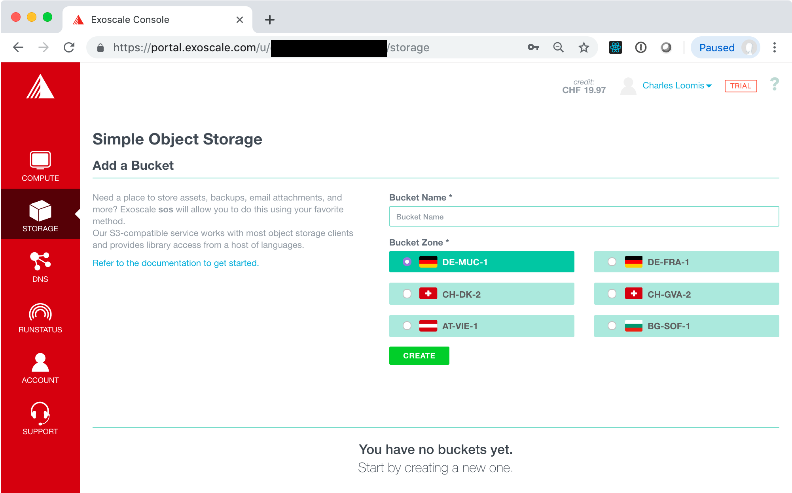
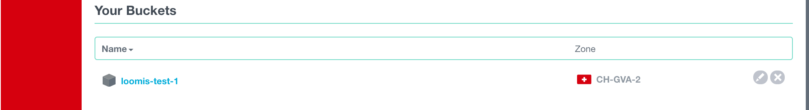
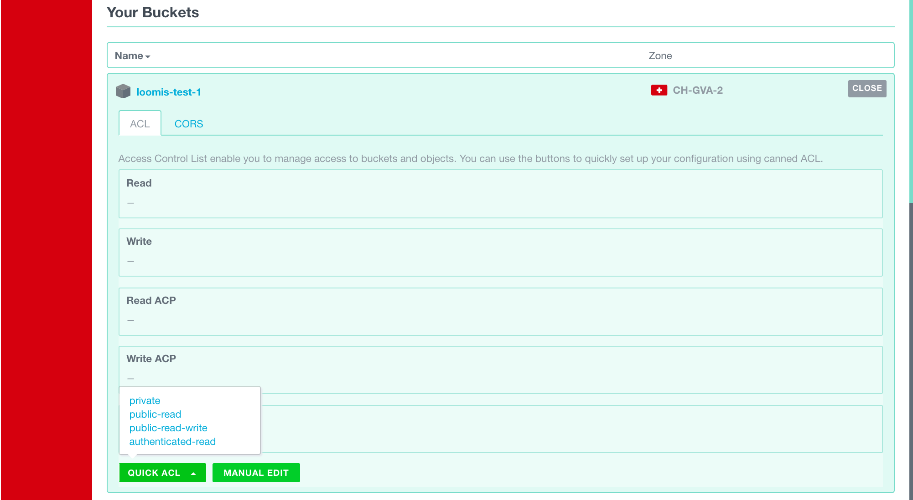
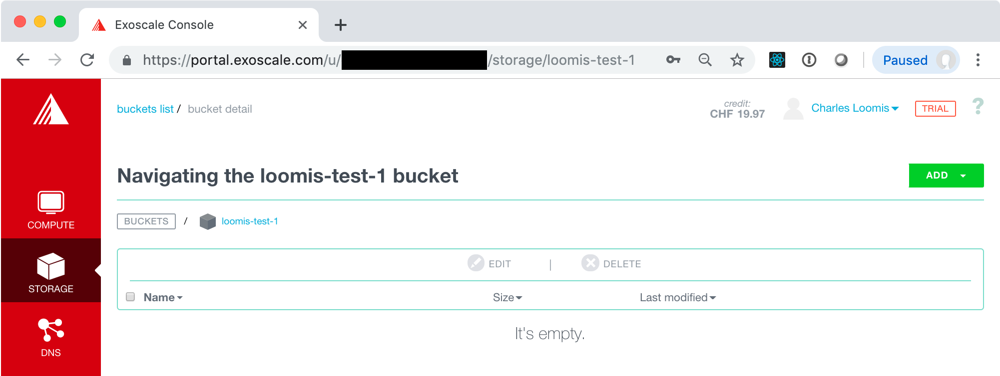
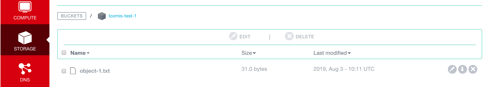

# Object Storage

All IaaS cloud providers offer an object storage service, usually
following Amazon's S3 API.

The model for object storage is simple:

 - An object contains the binary data associated with it, as well as
   metadata (key-value pairs) and access control information. An
   object must be contained in exactly one "bucket".

 - Buckets contain zero or more objects. They cannot be nested and
   each must have a service-wide, unique name.

Technically, buckets contain no structure and are simply a flat list
of the contained objects. By convention however, the objects are
organized into virtual directories by naming the objects with
slash-delimited paths.

## Create a Bucket

Log into the Exoscale portal and then navigate to the "STORAGE"
tab. You will see an empty list of your buckets.



Simply fill in the bucket name, select a region, and click on the
"CREATE" button. If all goes well, you will see your new bucket appear
in the list at the bottom on the page.



Before filling the bucket with some objects, experiment a bit with
creating more buckets.

 - Try using some special characters in the bucket name (e.g. '_', '
   ', '-', '), upper- and lower-case letters, numbers, etc. Can you
   understand the logic in the naming convention?

 - Try creating two buckets with the same name, but different
   regions. Does this work?

 - Try to create a bucket that has the same name as one of the other
   student's buckets.  Does this work?

Although these limitations seem arbitrary at the moment, you will
begin to understand the reason they're there when working with the
API.

Before moving on, click on the edit icon next to the bucket name. This
allows you to edit the Access Control List (ACL) for the bucket, which
controls who can access the objects contained in the bucket.



For buckets, the most useful settings are available in the "QUICK ACL"
dropdown. The options are:

 - **private**: Only the owner of the bucket can read the
   contents. This is the default.
     
 - **public-read**: Anyone (even those without an Exoscale account)
   can read, but not modify, the objects.

 - **public-read-write**: Anyone can read and modify the objects. This
   is generally a dangerous setting to use.

 - **authenticated-read**: Any authenticated Exoscale user can read,
   but not modify, the objects.

With the "MANUAL EDIT" button, you can specify access for specific
users or specific classes of users.

For your first bucket, leave the default ACL of "private".  Click on
the "CLOSE" button to close the bucket editing panel.

## Create Objects

In the list of buckets, click on the name of your first bucket. This
will bring up a list of objects in your bucket, which should be empty
at this point.



Create a file on your local machine containing some random text.

```
echo "my object contents 23948203984" > ~/object-1.txt
```

Now upload this file to your bucket. Click on the "ADD" button, select
"File", and then drag and drop the file into the dialog (or select it
through the file chooser).

After this operation, you should see your new object listed in the
bucket. 



On the right side of the object entry, you will see icons for editing,
downloading, and deleting the object.

Click on the "download" icon and verify that the contents of the file
are identical to what you uploaded. Note what the URL of the download
looks like.

The "edit" icon brings up a panel that has:

 - The full URL of the object, which can be used for direct access to
   the object.

 - An ACL editor that works in the same way as for a bucket. The ACL
   should start with the default ACL of the object's bucket.

 - A metadata editor. Here you can define key-value pairs that are
   associated with the object. These can be used to search for
   matching objects.

 - A panel where you can define headers sent when accessing the
   object's URL. The most useful (and required) is the "content-type"
   header. 

Use the edit panel to make the object public, add some metadata, and
change the content type of the file.

From the Linux command line, you can verify that the object can be
downloaded without authentication, the content-type is correct, and
that the file contains the expected text.

> NOTE: You can also do the same from a browser. Just use one where
> you are not logged into Exoscale. You will also need to use the
> browser's request inspector to see the headers. Because of
> redirection, the browser request inspector may not show the final
> headers. 

```
$ curl -i https://sos-ch-gva-2.exo.io/loomis-test-1/object-1.txt

HTTP/2 200 
server: nginx
date: Sat, 03 Aug 2019 10:38:03 GMT
content-type: text/plain
content-length: 31
x-amz-bucket-region: ch-gva-2
etag: "6e3599722afe2439f0833d89d8d97843"
last-modified: Sat, 03 Aug 2019 10:36:33 GMT
x-amz-meta-first-key: first-value
x-amz-request-id: 2dffa68a-eeff-4bb3-8334-9903806ab1cc
x-amzn-requestid: 2dffa68a-eeff-4bb3-8334-9903806ab1cc
x-amz-id-2: 2dffa68a-eeff-4bb3-8334-9903806ab1cc

my object contents 23948203984
```

Change the ACL of the object back to private and verify that the
object can no longer be downloaded without authentication.

```
$ curl -i https://sos-ch-gva-2.exo.io/loomis-test-1/object-1.txt

HTTP/2 403 
server: nginx
date: Sat, 03 Aug 2019 10:43:27 GMT
content-type: application/xml
content-length: 222
x-amz-bucket-region: ch-gva-2
x-amz-request-id: ffd92b36-5bc2-471d-80e8-1aeb3c930791
x-amzn-requestid: ffd92b36-5bc2-471d-80e8-1aeb3c930791
x-amz-id-2: ffd92b36-5bc2-471d-80e8-1aeb3c930791

<?xml version="1.0" encoding="UTF-8"?>
<Error>
  <Code>AccessDenied</Code>
  <Message>Access Denied</Message>
  <RequestId>ffd92b36-5bc2-471d-80e8-1aeb3c930791</RequestId>
  <HostId>ffd92b36-5bc2-471d-80e8-1aeb3c930791</HostId>
</Error>
```

Play with Exoscale's object storage interface to better understand how
it works and more importantly, the behavior of the underlying
service. Specifically:

 - Create some additional objects and folders. Understand how the
   folders affect the URLs of the objects.

 - Are you able to edit any of the characteristics of a folder?  How
   do these characteristics affect the contained objects? 

 - What happens if there is a difference between the ACL of a bucket,
   folder, and object?

 - What happens if you try to access the URL of a folder? (Try with or
   without a trailing slash.)

With this knowledge, can you create a mini-website of static content
with an S3 bucket?  This is actually a common use case for S3.

## Delete Objects and Buckets

Using the web-browser interface, experiment with deleting objects and
buckets. What happens when you delete:

 - An object,

 - A folder that contains objects?

 - An empty folder?

 - A bucket that still contains objects?

 - A bucket that still contains empty folders?

You will notice that the interface (and the underlying API) tries to
prevent unintentional loss of data.
