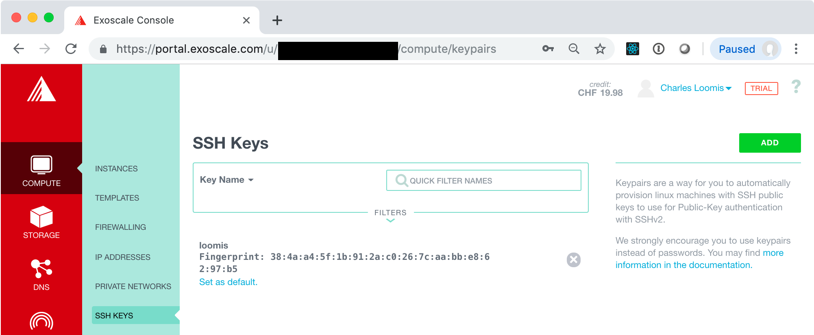

# Compute Lifecycle (Console)

Being able to manage the full lifecycle of virtual machines is the
primary feature of any IaaS cloud service. These exercises will show
you how to start, access, stop, and destroy a virtual machine on the
Exoscale cloud.

## Create a VM

Log into the [Exoscale portal](https://portal.exoscale.com/) with your
browser, if you are not already.

In the portal, go to the `COMPUTE/INSTANCES` tab. You will likely land
here if you're just logging into the portal.


On this page, click on the "ADD" button to bring up a form to select
the type of virtual machine you want to deploy.


In this form, provide the configuration for the virtual machine you
want to deploy:

 - **Hostname**: choose a descriptive name for your machine,
   e.g. "exercise1". The inline help will guide you to a valid value.
   
 - **Template**: the operating system to use, e.g. Linux Ubuntu
   18.04. Choose any Linux operating system with which you are
   confortable. Ubuntu and CentOS are common choices.
   
 - **Instance Type**: describes the number of vCPUs and amount of RAM,
   e.g. Tiny. Larger machines are more expensive.
   
 - **Disk**: size of the disk to attach to the virtual machine,
   e.g. 10 GB. Note: this disk space is **not** persistent!

 - **Zone**: the Exoscale data center to use, e.g. CH-GVA-2. Any zone
   should work.

Ignore the other field in the form for now.  Later in the exercises
you will deal with configuring the security groups and logging into
the machine with SSH.

Once you are happy with the machine configuration, click on the
"CREATE" button on the right hand side of the page. This will create
your virtual machine and redirect you to a page with the details.


The instance will initially be in the "STOPPED" state, but should
quickly become "RUNNING".

## Access VM via Console

Once it is running, you can access the machine via the console.

> **WARNING**: Using the console to access the machine is not
> recommended as a regular practice. Exercises below will show you how
> to access the machine via SSH.

To open the console, click on the "OPEN CONSOLE" button in the
upper-left corner. This will open another window with a web-based
console application. (If you've blocked pop-ups or new windows in your
browser, you'll need to change your browser configuration.)

From the detail page, you can find the user name to use in the SSH
command line.  In the example above, this is "ubuntu".  You can also
click on the "eye" icon in the SSH Password field to see the password
to use. You will probably have to type the password, as copy/paste
into the console may not work.


Type a few commands to be sure that the machine is working
correctly. For example, use `whoami` to see the current username or
`ping www.yobitrust.com` to be sure that you can access the Internet
from the VM.

Create a simple text file:

```
echo hello-tunisia > myfile.txt
ls myfile.txt
cat myfile.txt
```

This shows that the file was created and contains the string
"hello-tunisia".  We'll check the contents of this file again below.

## Stop a VM

From the detail page, you can stop the virtual machine. Click on the
"STOP" button in the action bar at the top and confirm the action with
a second click.

Once the machine is in the "STOPPED" state, the console should
disconnect. The machine is no longer running; however, the disk and
any data it contains has been saved.  The machine can be restarted
from a "STOPPED" state.

## Restart a VM

Click on the "START" button in the action bar. The VM should
eventually end up back in the "RUNNING" state. Once this is the case,
close the old console and open a new one.  Log in again and be sure
that the file you created earlier is still there.

```
cat myfile.txt
```

Does this contain the string "hello-tunisia"? 

## Destroying a VM

To complete destroy a VM and free all the associated resources
(including data on the attached disk), click on the "DESTROY" button
in the action bar and click a second time to confirm.

This will start the process to destroy the VM.  You will be directed
back to the instance list page. The VM you created should disappear
from the list once it has been completely cleaned up.

# SSH Configuration

In the previous exercise, you deployed a VM and then accessed it via
a web-based console. As mentioned earlier, this is **not** recommended
for regular use. Instead you should use SSH key pairs to access the
VMs that you deploy.

## Create SSH Key Pair

If you have an existing SSH key pair, you do not need to create a new
one. Just use the one that you have. 

If you do not have an SSH key pair already, then you will need to
create one. A new key pair can be created easily from the command line
on any machine that has SSH installed. Virtually all Linux operating
systems have SSH installed by default.  It is also available by
default on macOS.

Assuming that SSH is installed on your machine, open a terminal and
execute the following command:

```
ssh-keygen
```

You can then respond interactively to the prompts to generate your
key. 

```
Generating public/private rsa key pair.
Enter file in which to save the key (~/.ssh/id_rsa):
Enter passphrase (empty for no passphrase): 
Enter same passphrase again: 
Your identification has been saved in ~/.ssh/id_rsa_test.
Your public key has been saved in ~/.ssh/id_rsa_test.pub.
The key fingerprint is:
SHA256:LcG3FnpclJh2zQBODXDH1vCCxHBVQ9/WmF7hnXMg/TY loomis@Macintosh-3.local
The key's randomart image is:
+---[RSA 2048]----+
|        o+BOB@=. |
|       . *=+*o***|
|        o.=oo +=O|
|         * + o E=|
|        S *   ...|
|         +       |
|                 |
|                 |
|                 |
+----[SHA256]-----+
```

In the output above, the default location for the key has been used
(`${HOME}/.ssh/id_rsa`) and no passphrase was used.  If you provide a
passphrase, you'll need to provide it everytime you use the key. This
is generally annoying, but can be made easier with `ssh-agent`.

## Upload Public Key to Exoscale

Log into the Exoscale portal and then go to the `COMPUTE/SSH KEYS`
tab. If you've not yet registered an SSH key, then the page will look
like the following:


Click on the "Create one now!" link or the "ADD" button.  This will
bring up a form where you can import the key you have just
created. Make sure that the import tab is selected and then fill in
the fields.


Click the "IMPORT" button. This should redirect you to a page with a
list of SSH keys, which should now contain the one you just
imported. **You should also click on the link "Set as default" to
add this key to all your VMs automatically.**



> **NOTE**: You can also generate a key pair directly through the
> portal. Make sure you have the private key when it is presented. You
> will also need to recover the public key so it can be used from
> other machines.  

# Compute Lifecycle (Revisited)

In this exercise, you will revisit the compute lifecycle. This time
you will add the SSH key configuration to your VM and access the
deployed instance with SSH.

In the process of doing this, you will also learn about security
groups and how they affect access to your VMs.

## Create a VM

Return to the "COMPUTE/INSTANCES" tab, and click on the "ADD" button.

In the form for creating a new VM, you will repeat what you did
before, **except that you must be sure that an SSH key pair is
selected**.


If you set the key pair you created as the default, it will already be
selected. If not, you must select it manually.

Before creating the VM, take a look at the warning next to the
security group: 


This will cause problems with accessing the VM. Will we address this
problem after creating the VM.

Now click on "CREATE" to create a new VM. Wait until the machine
reaches the running state before moving on to the next part of the
exercise.

## Ping the Machine

Once the machine is started, you will be able to see its IPv4
address.  Try pinging this address and logging into the machine with
SSH.

```
$ ping 159.100.242.210 
PING 159.100.242.210 (159.100.242.210): 56 data bytes
Request timeout for icmp_seq 0
Request timeout for icmp_seq 1
Request timeout for icmp_seq 2
Request timeout for icmp_seq 3
Request timeout for icmp_seq 4
Request timeout for icmp_seq 5
Request timeout for icmp_seq 6
^C
--- 159.100.242.210 ping statistics ---
8 packets transmitted, 0 packets received, 100.0% packet loss
```

```
$ ssh ubuntu@159.100.242.210 
ssh: connect to host 159.100.242.210 port 22: Operation timed out
$
```

The above shows that both commands fail; the machine cannot be reached
via ping (ICMP) or SSH. 

## Security Groups

Security groups act as dynamic firewalls around your VMs. You can
define multiple security groups and also assign multiple groups to a
single VM.

Look at the details for the "default" security group which is used for
the running VM. Go to the "COMPUTE/FIREWALLING" tab in the Exoscale
portal and from there click on the "default" link (title of the
security group).

You should see something similar to the following screenshot.


There are no rules in this group, so **no network traffic can reach the
VM!** This clearly isn't useful in this case.  We need rules for at
least SSH and PING.  Use the buttons at the top to create those two
rules.


For other services, you will want to add other rules.  These can be
added with the "NEW RULE" button. That will be covered later when we
add more services to a VM.

## Access the VM

Now try to ping the machine again.

```
$ ping 159.100.242.210 
PING 159.100.242.210 (159.100.242.210): 56 data bytes
64 bytes from 159.100.242.210: icmp_seq=0 ttl=47 time=124.364 ms
64 bytes from 159.100.242.210: icmp_seq=1 ttl=47 time=94.815 ms
64 bytes from 159.100.242.210: icmp_seq=2 ttl=47 time=96.981 ms
64 bytes from 159.100.242.210: icmp_seq=3 ttl=47 time=91.871 ms
64 bytes from 159.100.242.210: icmp_seq=4 ttl=47 time=134.510 ms
^C
--- 159.100.242.210 ping statistics ---
5 packets transmitted, 5 packets received, 0.0% packet loss
round-trip min/avg/max/stddev = 91.871/108.508/134.510/17.462 ms
```

You should see that the machine can be contacted and that there are
reasonable transit times.

Now try again with SSH.

```
$ ssh ubuntu@159.100.242.210 
Warning: Permanently added '159.100.242.210' (ECDSA) to the list of known hosts.
Welcome to Ubuntu 18.04.2 LTS (GNU/Linux 4.15.0-50-generic x86_64)

 * Documentation:  https://help.ubuntu.com
 * Management:     https://landscape.canonical.com
 * Support:        https://ubuntu.com/advantage

  System information as of Fri Aug  2 19:32:37 UTC 2019

  System load:  0.0               Processes:           83
  Usage of /:   14.4% of 9.52GB   Users logged in:     0
  Memory usage: 19%               IP address for eth0: 159.100.242.210
  Swap usage:   0%


47 packages can be updated.
0 updates are security updates.


*** System restart required ***
ubuntu@test:~$ exit
logout
Connection to 159.100.242.210 closed.
```

This shows that the machine can be accessed via SSH. Everything works!

> **NOTE**: The VM didn't need to be restarted for the changes to the
> security group to take effect. Changes to security groups are
> applied dynamically!

## Destroy Machine

Now you can destroy the VM, using the same process as you did
earlier. You might want to try the ping and SSH commands again to be
sure that the machine really has disappeared.
