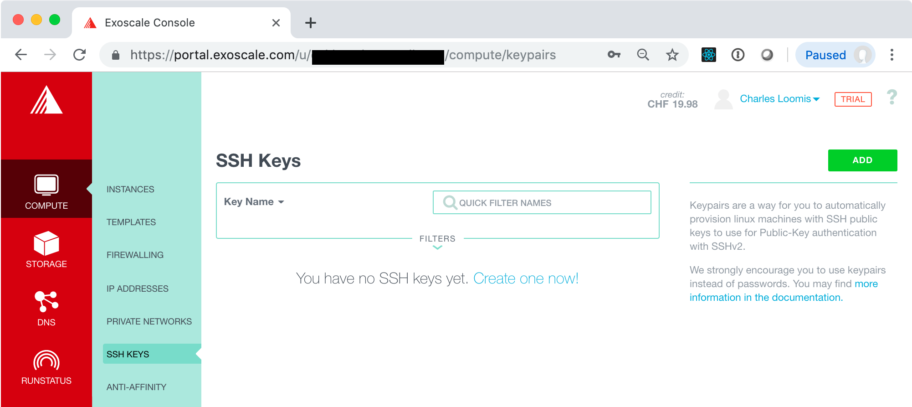
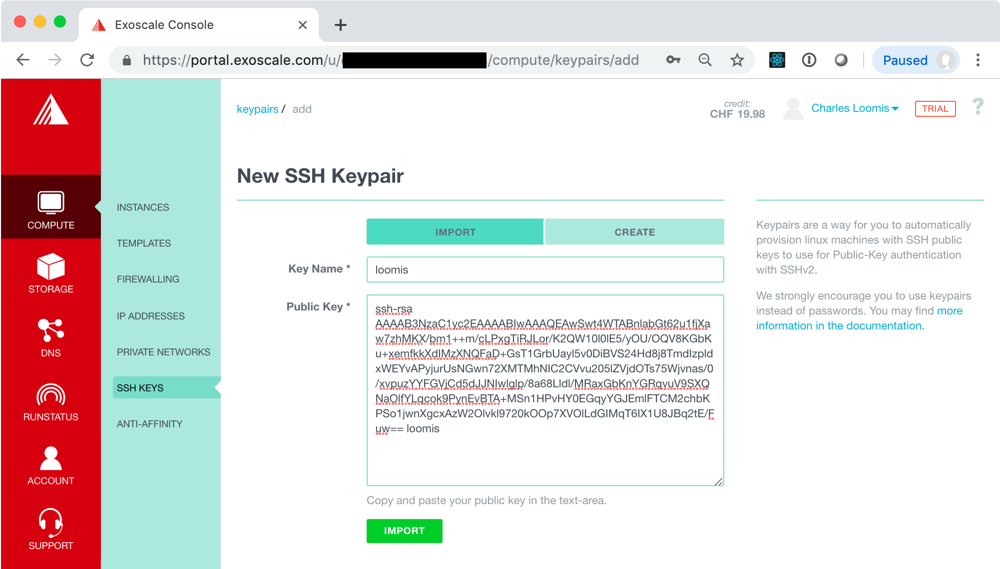
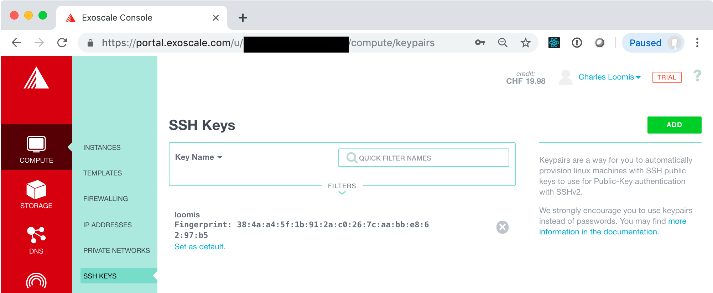

# Secure Shell (SSH)

In the previous exercise, you deployed a VM and then accessed it via
a web-based console. As mentioned earlier, this is **not** recommended
for regular use. Instead you should use SSH key pairs to access the
VMs that you deploy.

## Create SSH Key Pair

If you have an existing SSH key pair, you do not need to create a new
one. Just use the one that you have. 

If you do not have an SSH key pair already, then you will need to
create one. A new key pair can be created easily from the command line
on any machine that has SSH installed. Virtually all Linux operating
systems have SSH installed by default.  It is also available by
default on macOS.

Assuming that SSH is installed on your machine, open a terminal and
execute the following command:

```
ssh-keygen
```

You can then respond interactively to the prompts to generate your
key. 

```
Generating public/private rsa key pair.
Enter file in which to save the key (~/.ssh/id_rsa):
Enter passphrase (empty for no passphrase): 
Enter same passphrase again: 
Your identification has been saved in ~/.ssh/id_rsa_test.
Your public key has been saved in ~/.ssh/id_rsa_test.pub.
The key fingerprint is:
SHA256:LcG3FnpclJh2zQBODXDH1vCCxHBVQ9/WmF7hnXMg/TY loomis@Macintosh-3.local
The key's randomart image is:
+---[RSA 2048]----+
|        o+BOB@=. |
|       . *=+*o***|
|        o.=oo +=O|
|         * + o E=|
|        S *   ...|
|         +       |
|                 |
|                 |
|                 |
+----[SHA256]-----+
```

In the output above, the default location for the key has been used
(`${HOME}/.ssh/id_rsa`) and no passphrase was used.  If you provide a
passphrase, you'll need to provide it everytime you use the key. This
is generally annoying, but can be made easier with `ssh-agent`.

## Upload Public Key to Exoscale

Log into the Exoscale portal and then go to the `COMPUTE/SSH KEYS`
tab. If you've not yet registered an SSH key, then the page will look
like the following:



Click on the "Create one now!" link or the "ADD" button.  This will
bring up a form where you can import the key you have just
created. Make sure that the import tab is selected and then fill in
the fields.



Click the "IMPORT" button. This should redirect you to a page with a
list of SSH keys, which should now contain the one you just
imported. **You should also click on the link "Set as default" to
add this key to all your VMs automatically.**



> **NOTE**: You can also generate a key pair directly through the
> portal. Make sure you have the private key when it is presented. You
> will also need to recover the public key so it can be used from
> other machines.  
