# BalenaCloud

Up to this point, you have seen how to create multi-architecture
containers to support machines with different CPUs, how to install a
RPi with Ubuntu, how to install the Docker engine on the RPi, and how
to run Dockerized applications on the RPi.

Performing all those processes manually produces a working platform,
but manual interventions will not scale. That is, you cannot manage
effectively a large number of devices this way. This is where edge
management platform come in handy.

The first edge management platform we will use is
[BalenaCloud](https://www.balena.io/cloud/). This is a commercial
offering (with a free tier) that allows you to manage edge devices:
both the underlying operating system and the containerized
applications.

Although we will be using the RPi, BalenaCloud supports a large
variety of other, small computing devices. Application definitions are
stored in GitHub and there is a tight linkage between the services.

## Create Account

You must create a BalenaCloud account to use the platform. The account
is free for managing up to ten devices. Only one is needed for this
training.

To create an account, go to the
[BalenaCloud](https://www.balena.io/cloud/) home page. On this page,
click on the "Sign up" button in the upper, right-hand corner. It will
bring up the following page: 

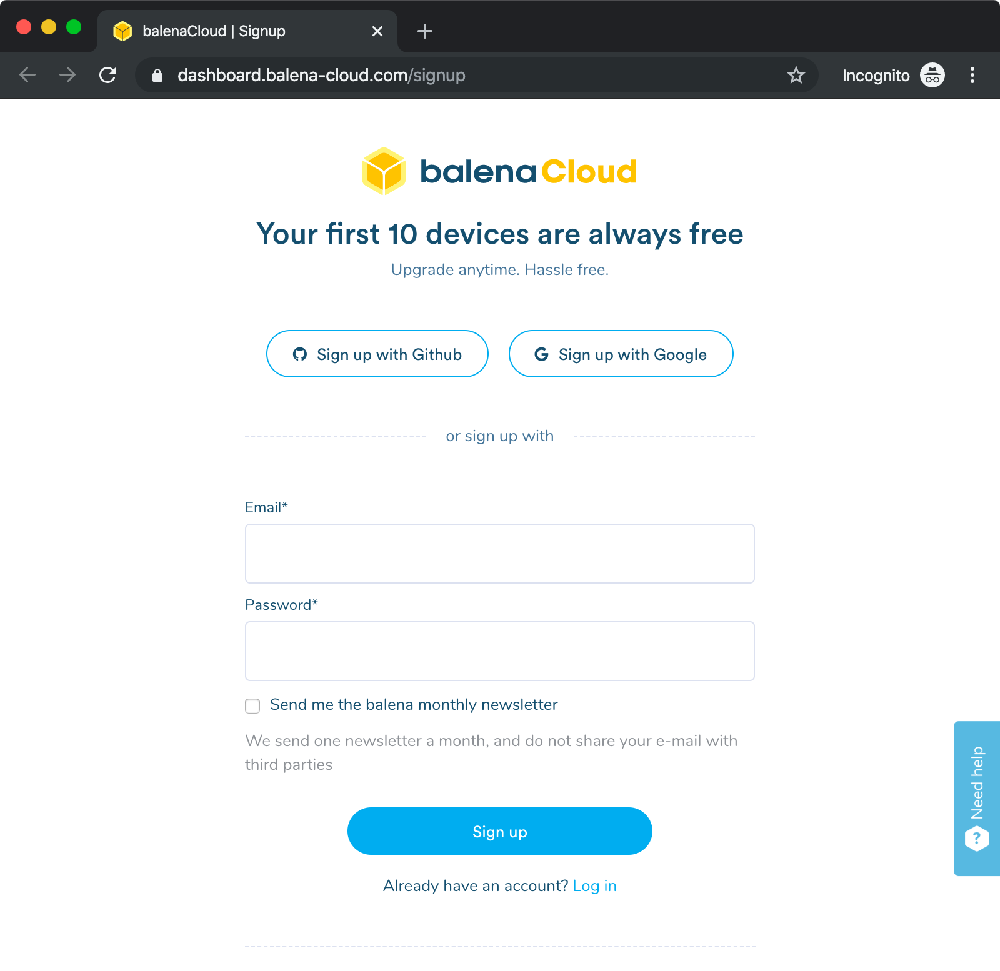

Although you can use any method to create your account, using the
Github method provides tigher integration with your application
definitions.

If you choose to use GitHub, you will be redirected to GitHub to
authorize BalenaCloud to access some of your account information.

## Create Application

The next step in the process is to create an application. For Balena,
an "application" is a group of devices running a single containerized
application. The application can have multiple versions. By default,
Balena will adjust the configuration of the devices to have the latest
release of the application. 

After you have created your account and signed in, your dashboard
should look like the following: 

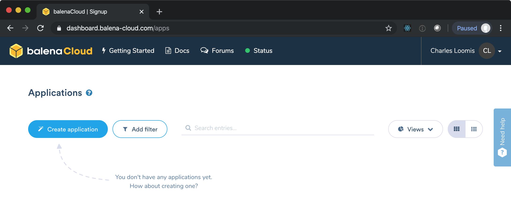

Click on the "Create application" button to bring up a dialog:

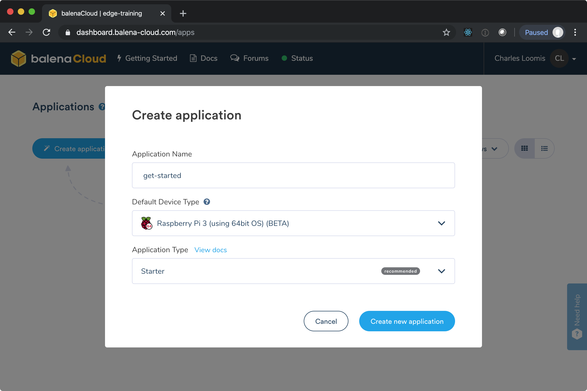

In the dialog, provide a name for your application (e.g get-started)
Set the default type to "Raspberry Pi 3 (using 64bit OS) and leave the
application type as "Starter". When you have completed the form, click
on "Create new application" button.

You will be directed to the "application" dashboard. This page has a
menu of configuration and management options down the left side of the
page. The main content is a list of devices in the application.

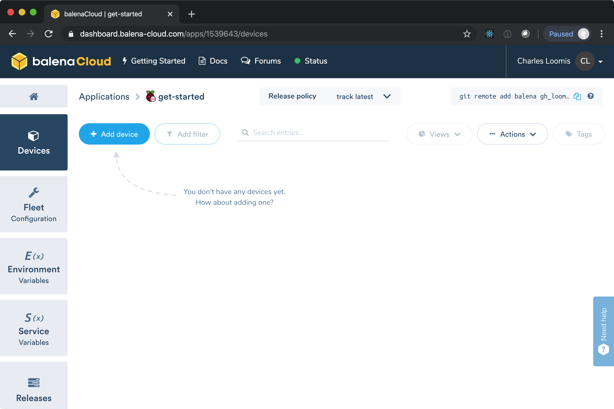

## Create Device

From the application dashboard, you can add a new device. Click on the
"Add device" button to bring up the dialog. 

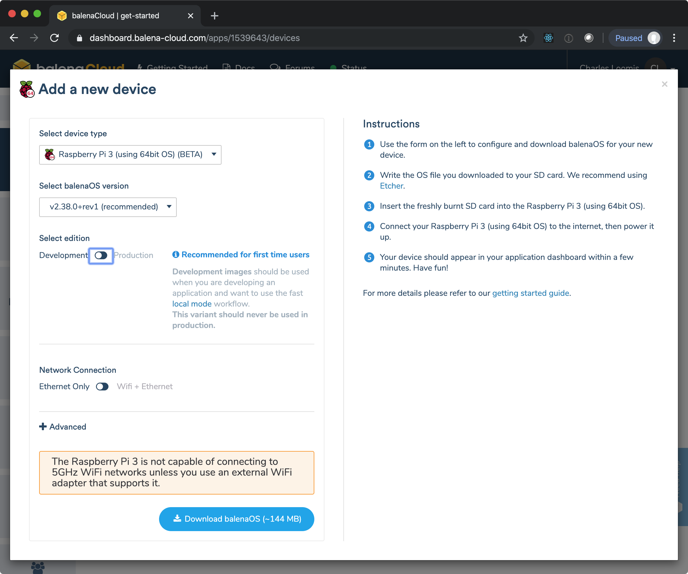

On the dialog, leave all the defaults except for changing the
"edition" to "Development" (even though the training won't demonstrate
"local mode" management). When everything is completed, click the
"Download" button at the bottom. This downloads the configured image
for your RPi. (It will have "balena-cloud" and your application name
in the file name.) You can close the dialog after the image has been
downloaded. 

If your RPi is running, stop it by using the `halt` command from the
root account. Unplug the RPi to power it down. 

With the **RPi powered down**, remove the microSD card. You will flash
the microSD card with the BalenaCloud image that you downloaded. As
before, use BalenaEtcher to flash the card. 

Once the card has been flashed, insert it into the RPi and boot the
machine. The RPi will automatically register with BalenaCloud and the
device will appear when it is available. This may take a couple of
minutes. 

Once the machine has booted, the application dashboard should show the
device. 

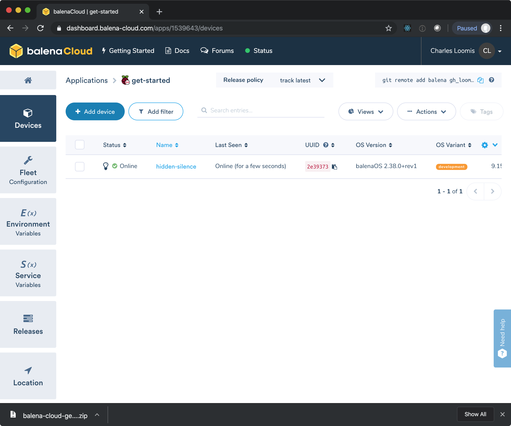

At this point, the device is running and is accessible; however, no
services are running yet because you have not yet defined an
application release.

## Create Release

On the left side of the application dashboard, click on the "Release"
button. This will bring up a dialog for creating a release to deploy
to the devices within your application. 

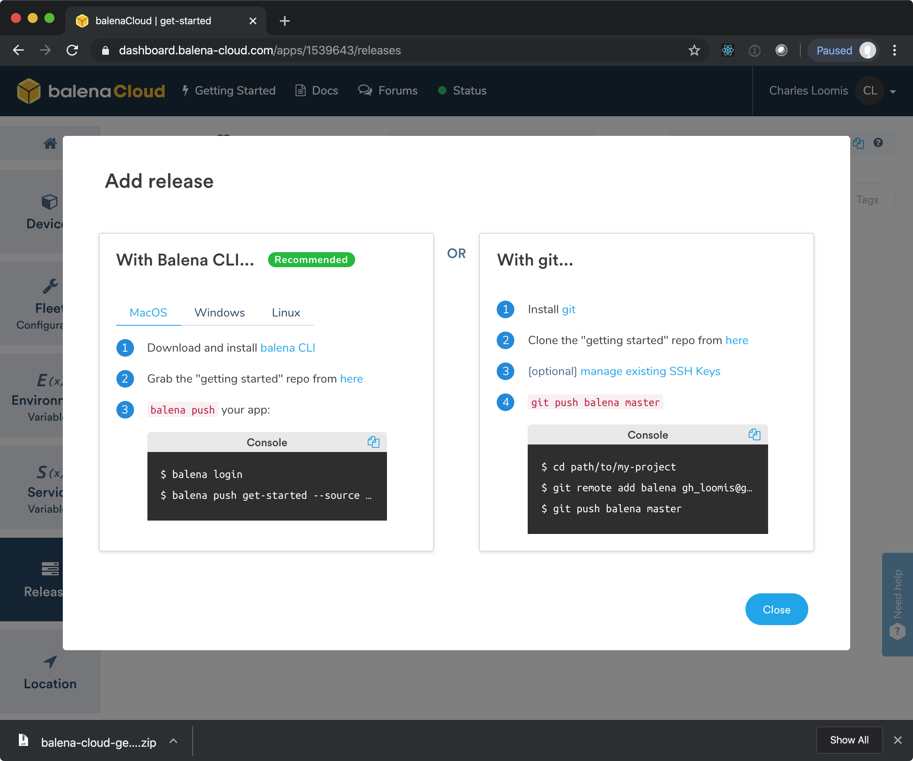

The recommended way to deploy applications with Balena is with the
Balena CLI (command line interface). Follow the instructions in the
dialog to install the Balena CLI. 

Start with running the Balena "getting started" application. Clone
this repository to your work machine:

```
git clone https://github.com/balena-io-projects/simple-server-node.git
cd simple-server-node
```

Copy the commands to be run, **modify the path**, and then run them:

```
balena login && balena push get-started --source path/to/my-project
```

You should see the build log of the application: 

```
 _            _
| |__   __ _ | |  ____  _ __    __ _
| '_ \ / _` || | / __ \| '_ \  / _` |
| |_) | (_) || ||  ___/| | | || (_) |
|_.__/ \__,_||_| \____/|_| |_| \__,_|


Logging in to balena-cloud.com
? How would you like to login? Web authorization (recommended)
Connecting to the web dashboard
Successfully logged in as: gh_loomis

Find out about the available commands by running:

  $ balena help

If you need help, or just want to say hi, don't hesitate in reaching out
through our discussion and support forums at https://forums.balena.io

For bug reports or feature requests, have a look at the GitHub issues or
create a new one at: https://github.com/balena-io/balena-cli/issues/
[Info]     Starting build for get-started, user gh_loomis
[Info]     Dashboard link: https://dashboard.balena-cloud.com/apps/1539643/devices
[Info]     Building on arm03
[Info]     Pulling previous images for caching purposes...
[Success]  Successfully pulled cache images
[main]     Step 1/7 : FROM balenalib/raspberrypi3-64-node:10-stretch-run
...
```

If all goes well, the log will end with a unicorn and the release will
be shown in the dashboard:

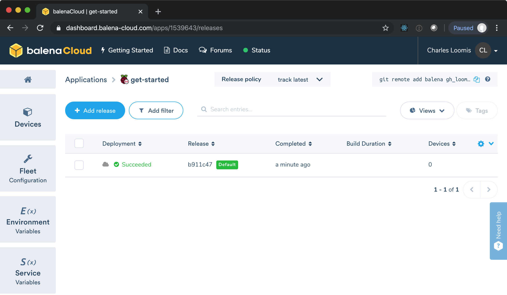

The release should be started automatically on your RPi. Click on the
"Devices" tab on the left, then on the device name in the list. This
should bring up the device details page. It should show you the
current update status, the logs, and provide a terminal for accessing
the machine. 

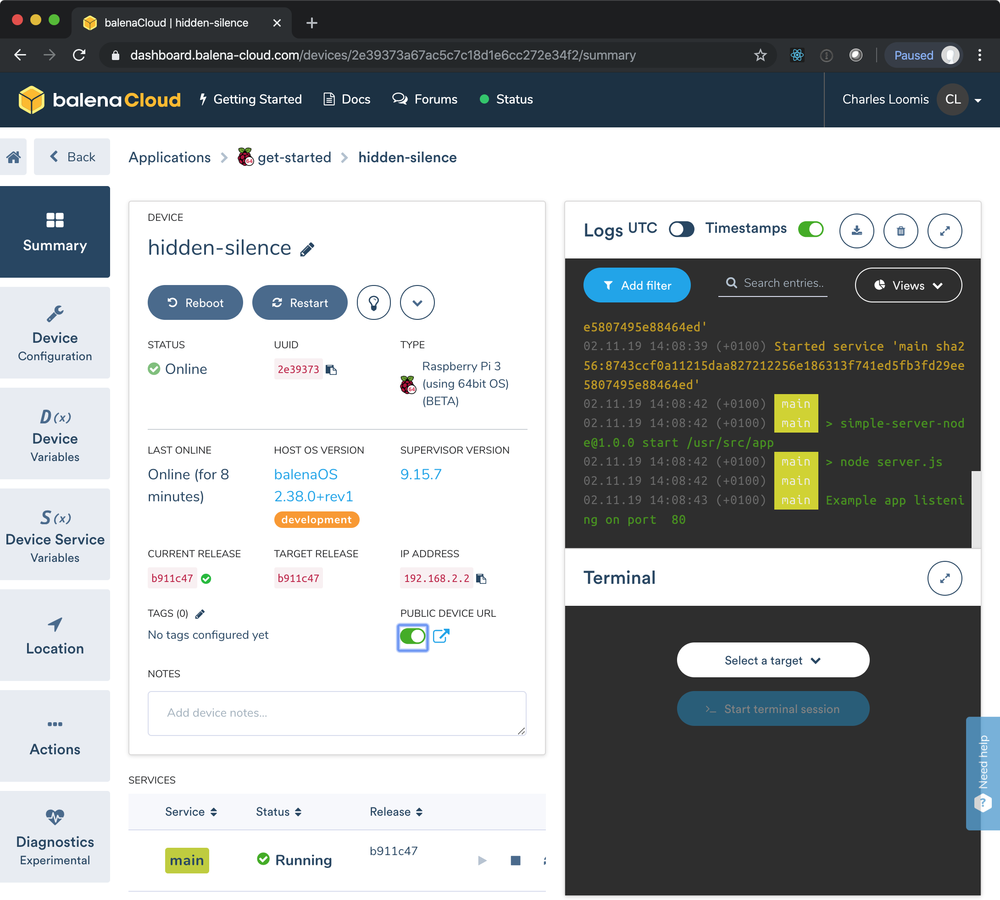

When the release has been fully deployed, you should see a status of
"Running" at the bottom of the page and "Example app listening on port
80" in the logs. 

On this page, toggle the "PUBLIC DEVICE URL" and then click on the
link. This should bring up the web page of the example application. 

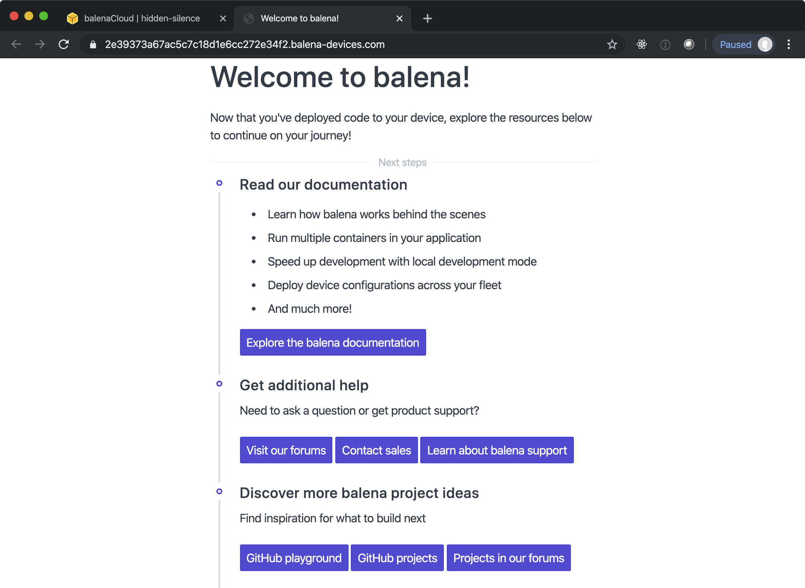

## Customized Webserver

To show that this works also with your customized webserver, create a
new application (e.g. webserver) in Balena from the "Applications"
page.

Click on the "Releases" tab on the left and add a new release. This
time use the git commands to push the release to Balena. 

```
cd path/to/example-webserver
git remote add balena gh_loomis@git.balena-cloud.com:gh_loomis/webserver.git 
git push balena master
```

The path that you use and the value of the `git remote` command will
be different for each user. The last command should trigger the build
of the container. If it ends successfully, you will see release listed
in the Balena dashboard. 

You have defined an application and a release, but there are no
devices tied to the application. Let's move our existing device from
the "get-started" application to the "webserver" application. 

In the dashboard navigate to the device detail page for your running
device. It will be listed under the "get-started" application. 

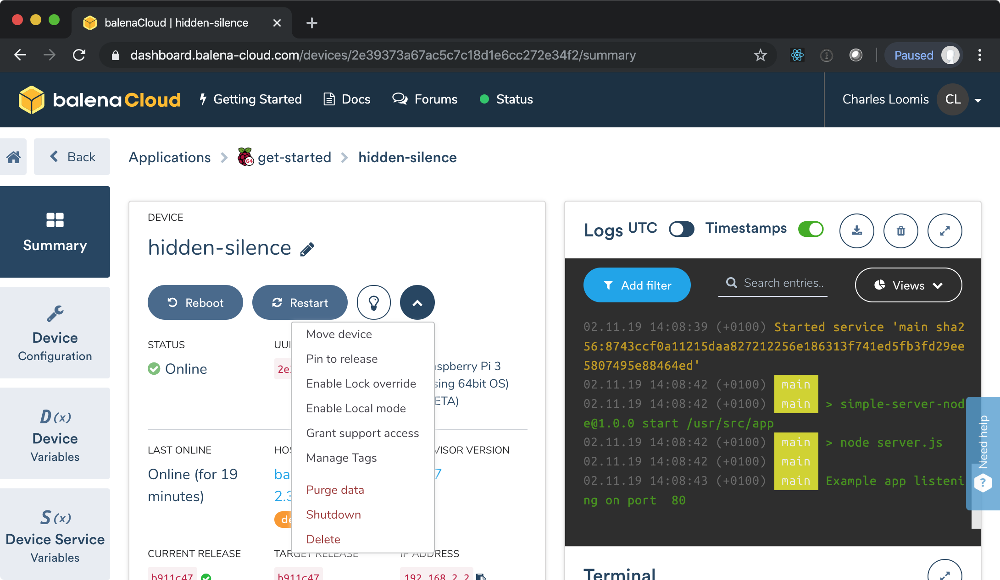

Open the menu and click on the "Move device" option. Choose the new
application and then click "Done". 

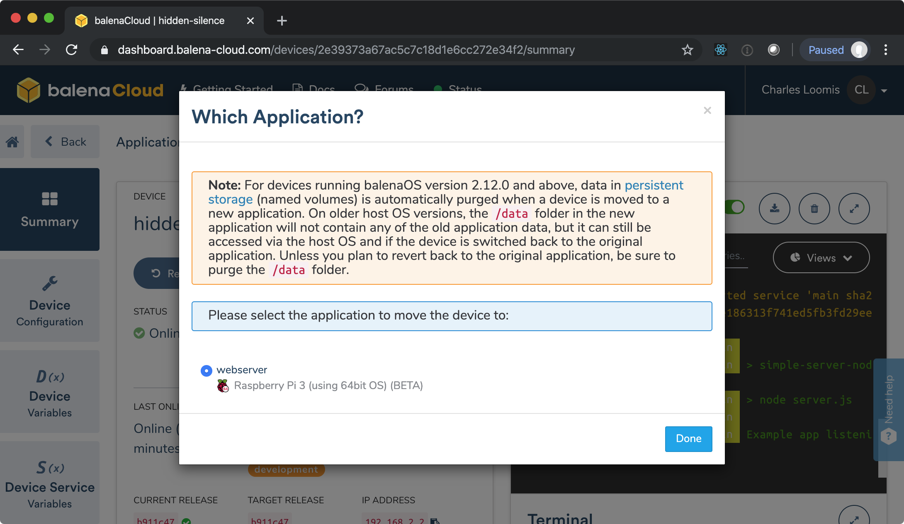

There will be another dialog to confirm that you want to move the
device. Type in the name of the target application ("webserver") to
continue.

You should automatically be moved to the new application and the
device should be in an "updating" state initially. Eventually, it will
be marked as "Online". 

Navigate to the details page of the device, ensure that the release is
correct and then click on the public URL. You should see the welcome
page of your customized webserver. 

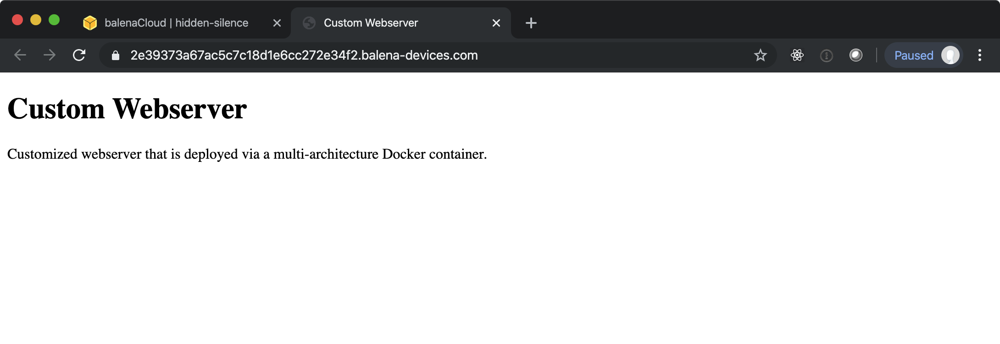

You can see that moving a device between applications automatically
updates the software running on the device. 

## OpenCV Demonstration

You should now be able to repeat the same process with the OpenCV
example application. 

When the application is running on your RPi, try the public device
URL.  You will see an error message like the following: 

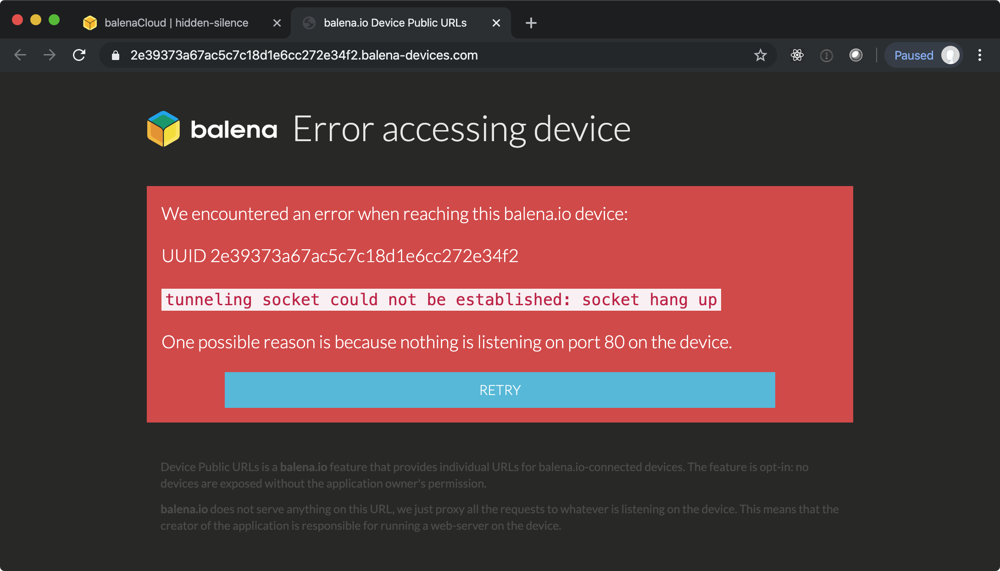

This is because the public URL provided by Balena will only proxy a
service running on port 80. The webserver for the OpenCV example is
running on port 5000.

However, you can access the service directly because Balena exposes
all ports by default. You can find the IP address of the machine on
the device detail page. You can then visit the URL
`http://YOUR_RPI_IP:5000` to see the OpenCV demo page. Verify that
this works for you.

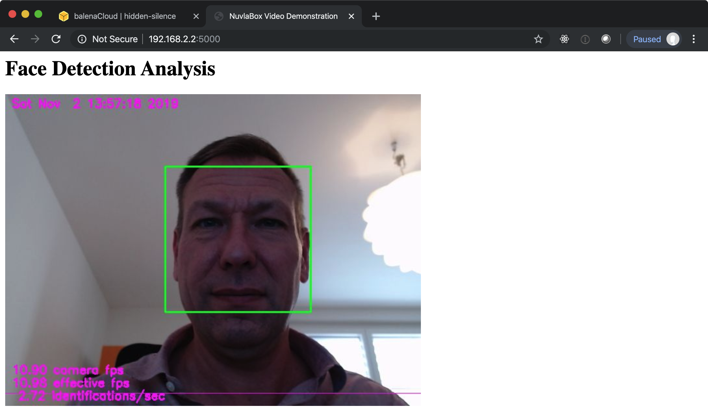

## Reflection

You have seen how to manage edge devices through the BalenaCloud,
including applications and releases. It is useful to take a step back
and think about what aspects of the system you liked and
disliked. 

Consider the system from the viewpoint of an administrator, a
developer, and an end-user. Which features appeal to each type of
user? Are there any critical missing pieces for any of these people?

## Other Solutions

There are a number of other IoT solution, all of which take slightly
different technical and business approaches to edge computing. Some of
these solutions include:

 * [Azure IoT](https://azure.microsoft.com/en-us/free/iot/)

 * [Amazon IoT](https://aws.amazon.com/iot/)

 * [Nuvla](https://sixsq.com/products-and-services/nuvla/overview) and
   [NuvlaBox](https://sixsq.com/products-and-services/nuvlabox/overview) 

Review their offerings and compare their features and cost
structures. How do these compare with BalenaCloud? What are the
strengths and weaknesses of each one with respect to ease of use,
device support, security, maintainability, operations, etc.?
