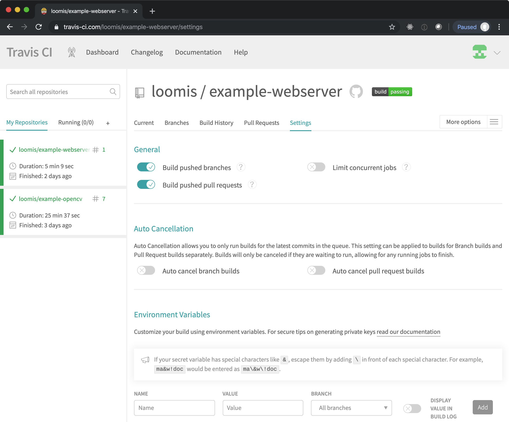

# Containers

Because of the limited power of processors in small devices, it was
necessary to write applications tuned to each processor. Embedding
applications into devices in this way optimizes the performance, but
complicates development and maintenance.

The increasing capacity of low-power processors has reduced the need
for true embedded programming. The Raspberry Pi 3 and 4, for example,
provide small, low-power platforms that easily support standard
operating systems and applications. On such platforms, developers can
use standard tooling to reduce development time and simplify
application deployment.

Creating containerized applications and deploying them onto edge
devices is a tactic used by several edge computing platforms. Reuse of
the Docker ecosystem speeds development, simplifies testing, and
allows dynamic deployment (and caching) of applications, while the
application's footprint on the device.

However, there is one major complication when targeting multiple edge
devices: you must create "multi-architecture" containers that are
adapted to each CPU you want to support. The CPU architectures
commonly at the moment are the "amd64" instruction set found in NUC
computers and the arm/arm64 instructions set found in Raspberry Pis.

In this section of the training, you will review how to use Docker to
create and deploy a customized application. This section will show you
how to create multi-architecture containers that support the amd64,
arm, and arm64 instruction sets.

You will use GitHub to manage your application definition and use
TravisCI to build your multi-architecture containers and push them to
Docker Hub.

## GitHub

The build process for a container is driven by a `Dockerfile`, which
is essentially a script for constructing the final containers. It is
entirely appropriate that the Dockerfile (and supporting files) be
treated as source code and managed through a code versioning system
like `git`.

For this training, use [GitHub](https://github.com). This platform
uses `git` as the code versioning system and provides a number of
additional services (e.g. issue tracking) that make it a compelling
platform for developers.

Tasks:

 * Create an account on GitHub, if you do not already have one. A free
   account will allow you to create as many public repositories as you
   want.
   
 * Create a repository on GitHub to hold the code for your customized
   container. (The name "example-webserver" is probably appropriate,
   but you can choose anything.) It is usually easiest if you
   initialize the repository with the default `README` file.

Make sure that you understand the standard `git` workflow for cloning
a repository, make changes to your workspace, and how to push those
changes to GitHub. Although many actions can be done through the
GitHub browser interface, **it is strongly recommended that you work
on a Linux or Mac OS machine and synchronize your changes with the
your repository on GitHub.** The machine you work on can either be
your laptop or a virtual machine running in a cloud.

If you prefer a graphical interface for working with GitHub, you can
try [GitHub Desktop](https://desktop.github.com/).

Tasks:

 * Clone your new repository to the machine where you will develop
   your customized container.

 * Update the `README` file and add/commit those changes.

 * Push the changed file to your GitHub repository and verify that the
   changed file appears in GitHub.

 * Make a change to the `README` file through GitHub's browser
   interface.

 * Pull those changes to your local copy and ensure that the changes
   you made through the web interface appear locally. 

At this point, you should be ready to add the files to define your
customized container.

## Docker

Install Docker on the machine on which you are working. The [Docker
documentation](https://docs.docker.com/) has installation instructions
for all supported platforms. Some of the installations provide a
graphical interface to Docker, but **it is strongly recommended that
you familiarize yourself with the Docker command line interface**.

After you have installed Docker, test that everything works correctly.

Tasks:

 * Install Docker on your work machine.

 * Run the "hello-world" example: `docker run hello-world`.

 * Start an Ubuntu 18.04 container and access it interactively:
   `docker run -it ubuntu:18.04 /bin/bash`. Type "exit" to leave the
   container and to stop it. 

At this point you should be ready to create, build, and test a
customized webserver, using Docker.

## Customized Webserver

As a simple example, we will create a customized webserver. This
webserver will be based on Ubuntu 18.04, will use the standard "nginx"
webserver packages, and will provide a personalized welcome page.

Although any Linux distribution could be used, we choose to base our
container on Ubuntu 18.04 because it is a well maintained,
multi-architecture container that supports the architectures that we
need (amd64, arm, and arm64).

First, create the `Dockerfile` that will define the build for the
container. This should be at the root of your "example-webserver"
repository. The contents of the file should be as follows.

Define the base container that you'll use:

```
FROM ubuntu:18.04
```

Next, install the "nginx" package:

```
RUN export DEBIAN_FRONTEND=noninteractive && \
    apt-get update && \
    apt-get upgrade -y && \
    apt-get install -y nginx -qq && \
    apt-get clean && \
    rm -fr /var/lib/apt/lists
```

This is a standard pattern that you will see in container
definitions. The full command updates the machine, installs the
necessary packages (in this case "nginx"), and then cleans up any
temporary files. The environmental variable and command flags ensure
that this is an entirely non-interactive process.

Change the server configuration, adding a new welcome page and
removing the default. (You'll add those files shortly.)

```
ADD nginx.conf /etc/nginx/nginx.conf
ADD custom /etc/nginx/sites-available/custom
ADD index.html /var/www/html-custom/index.html
RUN rm /etc/nginx/sites-enabled/default && \
    ln -sf /etc/nginx/sites-available/custom /etc/nginx/sites-enabled/custom
```

To make the logging more "container-friendly" you can add the
following lines:

```
RUN ln -sf /dev/stdout /var/log/nginx/access.log && \
    ln -sf /dev/stderr /var/log/nginx/error.log
```

This will allow you to see the logs using the `docker logs` command.

Finally, define the command to start the webserver:

```
CMD ["/usr/sbin/nginx"]
```

You should now have a complete `Dockerfile`. Save this and push the
file to GitHub.

Create the `index.html` file. This is the HTML for your customized
welcome page.  Feel free to personalize it.

```
<!DOCTYPE html>
<html>
  <head>
    <title>Custom Webserver</title>
  </head>
  <body>
    <h1>Custom Webserver</h1>
    
    <p>
      Customized webserver that is deployed via a
      multi-architecture Docker container.
    </p>
  </body>
</html>
```

Also create the file `nginx.conf`, with the following contents:

```
user www-data;
daemon off;
worker_processes auto;
pid /run/nginx.pid;
include /etc/nginx/modules-enabled/*.conf;

events {
	worker_connections 768;
}

http {

	##
	# Basic Settings
	##

	sendfile on;
	tcp_nopush on;
	tcp_nodelay on;
	keepalive_timeout 65;
	types_hash_max_size 2048;

	include /etc/nginx/mime.types;
	default_type application/octet-stream;

	##
	# SSL Settings
	##

	ssl_protocols TLSv1 TLSv1.1 TLSv1.2; # Dropping SSLv3, ref: POODLE
	ssl_prefer_server_ciphers on;

	##
	# Logging Settings
	##

	access_log /var/log/nginx/access.log;
	error_log /var/log/nginx/error.log;

	##
	# Gzip Settings
	##

	gzip on;

	##
	# Virtual Host Configs
	##

	include /etc/nginx/conf.d/*.conf;
	include /etc/nginx/sites-enabled/*;
}
```

This is a slightly modified copy of the standard nginx configuration
file. The most important change is the line "daemon off;", which
forces the webserver to run in the foreground.

Create the file `custom` with the following contents:

```
server {
	listen 80 default_server;
	listen [::]:80 default_server;

	root /var/www/html-custom;

	# Add index.php to the list if you are using PHP
	index index.html index.htm index.nginx-debian.html;

	server_name _;

	location / {
		# First attempt to serve request as file, then
		# as directory, then fall back to displaying a 404.
		try_files $uri $uri/ =404;
	}

}
```

This is used to change from the "default" webserver home page to the
one you have created.  

Save these files and push them to your GitHub repository.

Now you are ready to build and test your modified container.

Tasks:

 * Build your container by running the command `docker build .` at the
   root of your cloned repository. You should see the output from the
   package installation and other steps. If the command is successful,
   you will see the UUID of the generated image.

 * Run the new image with the command `docker run -p 8080:80 -d UUID`,
   replacing "UUID" with the real UUID of the image.

 * Verify that that you see your customized welcome page when visiting
   `http://localhost:8080`. (If you're not developing on your local
   machine, then replace "localhost" with the IP address of your
   machine.)

 * Run `docker container ls` to find the UUID of your running
   container and use `docker container rm -f UUID` to stop and remove
   the container.

If everything worked, then you are ready to push your customized
container to Docker Hub.

A complete example can be found in the
[loomis/example-webserver](https://github.com/loomis/example-webserver)
repository.

## Docker Hub

[Docker Hub](https://hub.docker.com) is a service that allows you to
store and to share your customized containers. You will use this to do
exactly that.

Tasks:

 * Create a Docker Hub account, if you don't already have one. Click
   on the "Get Started" or "Sign up for Docker Hub" button to start
   the process.

 * When logged in to Docker Hub, create a new repository. A good name
   is "example-webserver" and optionally provide a description.  Click
   on "create".

 * From the detail page for your new repository, click on the
   "Collaborators" tab and add your own docker ID as a collaborator.

At this point, you should be able to push new images to your new
Docker Hub repository.

Tasks:

 * Rebuild your customized webserver on your work machine. Use the
   command `docker build . --tag DOCKER_ID/example-webserver`,
   replacing DOCKER_ID with your personal docker ID.

 * Verify that you see the tagged image on your machine: `docker image
   ls`.

 * Use the command line to log into Docker Hub: `docker login`. You'll
   need to provide your docker ID and password.

 * Push your customized image to Docker Hub: `docker push
   DOCKER_ID/example-webserver`.

 * Verify that you see the pushed image on Docker Hub. 

At this point, you have an image that has been pushed to Docker Hub
and can be run by anyone by using the tag DOCKER_ID/example-webserver.

Tasks:

 * Remove your local image: `docker image rm
   DOCKER_ID/example-webserver`.

 * Re-run your image with `docker run -p 8080:80 -d
   DOCKER_ID/example-webserver` and ensure that the image is pulled
   from Docker Hub and that it works.

 * Stop your container.

 * Start a virtual machine on Exoscale, install Docker there, and then
   run your customized container there. Again, ensure that it works. 

At this point, you have a container definition managed in GitHub and a
customized image available from Docker Hub. Now you will create a
multi-architecture image that will also be able to run on a Raspberry
Pi machine. 

## Travis CI

[Travis CI](https://travis-ci.com/) is a continuous integration
service that integrates well with GitHub. You will use this service to
rebuild your image and push th result to Docker Hub everytime you make
changes to your GitHub repository.

Tasks:

 * Authorize [TravisCI](https://travis-ci.com/) to access your GitHub
   account. Click on the "Sign up with GitHub" if you do not already
   have a TravisCI account. This will redirect you to GitHub for
   authentication/authorization. 

 * Either authorize TravisCI to build all your GitHub repositories or,
   at a minimum, authorize TravisCI for your "example-webserver"
   repository.

 * From the TravisCI dashboard you should see an empty list of
   "builds".

You are now ready to add the Travis CI configuration to your
"example-webserver" repository. 

From the
[loomis/example-webserver](https://github.com/loomis/example-webserver)
repository, copy the files:

 * `.travis.yml`
 * `.travis.script.sh`
 * `.travis.before_install.sh`

to your "example-webserver" repository. These files define how Travis
CI will build and push your container.

**Before pushing these files to GitHub, you must make a few changes!**

In the `.travis.script.sh` file:

```
DOCKER_ORG="clomps"
```

change the value from "clomps" to your docker ID.  If you have chosen
a name other than "example-webserver" for your Docker Hub repository,
then you must also change that value.

In the `.travis.yml` file, remove the complete `:env` section,
including the `:global` and `:secure` keys.  Save the modified file.

Go to the settings page for your repository in Travis CI. You can find
this page by opening the menu in the top-right corner and selecting
"settings". In the "repositories" tab on the settings page, click on
the "settings" button next to your repository. You should see a page
like the following screenshot.



In the environmental variables section, define the two variables:

 * `DOCKER_USERNAME`
 * `DOCKER_PASSWORD`
 
The values for these variables are your ID and password from Docker
Hub. These variables are used to push images to your Docker Hub
repository.

Read the note about escaping special characters in the value. Leave
the "all branches" setting and do not display the values in the build
log.

**Now, push the updated `.travis/*` files to your GitHub repository.**
You should see a new build starting in the Travis CI dashboard.

Tasks:

 * Verify that the Travis CI build finished successfully.

 * Verify that new images have been pushed to your Docker Hub
   repository. There should be four different tags. 

 * Update your `index.html` file and push the change to GitHub.

 * Verify that a new build has started and once completed, ensure that
   new images have been created in Docker Hub. 

 * Start a new container with the latest images and ensure that your
   modified `index.html` has been used. 

At this point, you have defined a complete "continuous integration"
chain for your customized webserver and tested that the "amd64" image
works correctly. Next we will run your container on a Raspberry Pi to
check the other architectures.
