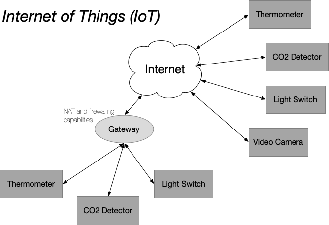

# Edge Platforms

## Internet of Things

The initial idea for creating a platform of devices (e.g. light
controllers, environmental sensors) was simply to have each device
connect directly to the Internet. Because the HTTP protocol is so
lightweight, embedding this protocol in devices is cheap and
easy. This approach is broadly called the "Internet of Things" or
IoT.

One technical issue that arises with a pure IoT approach is that the
total number of devices in the world easy exceeds the number of
available IPv4 addresses. This can be addressed by using NAT with
local addresses or by switching to IPv6 addressing. (The IoT issue was
one of the motivators for the IPv6 development.)

However, there are deeper concerns with the pure IoT approach. For
example, how is security handled and how do you implement proper
authentication and authorization for the devices? Unlike the HTTP
protocol, adding authentication and authorization, as well as their
configuration, is not trivial to accomplish is small, cheap devices.

These concerns are not merely theoretical, there have been a number of
distributed denial of service (DDoS) attacks that have used IoT
devices to amplify the scale of those attacks. The IoT devices used in
these attacks often have no security protocols or use default
passwords that often not changed.

## Edge

Several trends have contributed to the emergence of edge
computing. The security concerns for IoT and limited availability of
IPv4 addresses have pushed developers towards the use of gateways. The
need for energy-efficient, high-performance CPUs in mobile phones and
tablets and make it possible to build gateways that have significant
computing capacity, memory, and storage. Lastly, the wide-spread
adoption of hybrid cloud computing has provided the framework for
structuring IoT devices inside of an edge architecture.

## Reflection

Imagine that you want to deploy a smart transport system. What
features would you be looking for in an edge platform? Consider all
aspects of the platform: development, deployment, operation,
maintenance, legal constraints, scale, etc.

What features would you expect when deploying a street lighting
system? Again consider all aspects.

What are the similarities and differences between the two cases?
