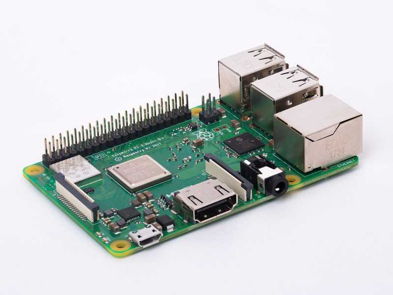

# Raspberry Pi

Driven by the market for ultra-portable laptops and tables,
energy-efficient processors have become more capable and cheaper.  As
a consequence, small, general-purpose computers have become available
at attractive prices.

Large suppliers have such offerings targeting the edge market. For
example, Intel has the
[NUC](https://www.intel.com/content/www/us/en/products/boards-kits/nuc.html)
(Next Unit of Computing) line of machines and HPE has the
[Edgeline](https://www.hpe.com/emea_europe/en/servers/edgeline-systems.html)
series.

Arguably, the best known examples are the Raspberry Pi (RPi)
machines. The RPi 3B+ has a retail price of 35 USD:

 * ARMv8 processor at 1.4 GHz,
 * 1 GB RAM
 * 2.4 and 5 GHZ wifi
 * Bluetooth BLE
 * Gigabit ethernet
 * Connectors: HDMI, USB, camera port, DSI display port

This is a machine capable of running standard Linux operating systems
well and having enough computing power for multiple, light-weight
application. Recently, the RPi 4 has been announced at a similar price
point, with significant upgrades and support for up to 4 GB of RAM.



NUC, Edgeline, and Raspberry Pi machines make attractive machines for
edge devices because they run standard operating systems, can
communicate with a variety of sensors/actuators and, most importantly,
support standard application deployment environments, like Docker.

You will configure a Raspberry Pi and use it to run you customized
webserver. Initially, you will do this manually. Afterwards, you will
use a couple of edge management platforms for comparison.

## Boot Disk

The RPi 3B+ boots from a microSD card. This card contains the complete
operating system and acts as the "hard disk" for the system. There are
[several operating systems](https://www.raspberrypi.org/downloads/)
that support the RPi. The native operating system is Raspbian, which
is based on Debian. We will use Ubuntu Server 18.04.

**To create the boot disk, you will need to have a machine with an SD
card reader.** If your machine doesn't have one, work with another
student or the instructor.

Download the image from the [Ubuntu
18.04](http://cdimage.ubuntu.com/releases/18.04.3/release/) release
page. Although both the 32-bit and 64-bit ARM images will work on the
RPi, **use the image for 64-bit ARM processor.** (To avoid slow
downloads, this image is also available from the instructor on a USB
key.)

Download and install [Balena
Etcher](https://www.balena.io/etcher/). This application greatly
simplifies creating the boot disk. It runs on Mac OS, Windows, and
Linux. (If you're using Mac OS Catalina, [see this
issue](https://github.com/balena-io/etcher/issues/2833) for a
workaround.)

Use Balena Etcher to flash the Ubuntu Server 18.04 image to the SD
card. Once this is done, insert the microSD card into the RPi, connect
the ethernet cable and power up the machine.

Use the `arp-scan`, `nmap` or other command to find the IP address of
your machine. (Or work with the network administrator to find the
address.) 

## Configuration

The operating system that you have installed is a very minimal version
of Ubuntu 18.04. You will need to upgrade the OS and install some
additional software.

First, log into your machine:

```
ssh ubuntu@YOUR_RPI_IP
```

change `YOUR_RPI_IP` to the address for your machine. The initial
username and initial password are both "ubuntu". The OS will force you
to change the password on your first login. Change the value to what
your want, but **remember the password that you choose!**

Once you've changed the password, you will have to log back into your
machine.

From the "ubuntu" account, switch to the "root" account with the
command `sudo su -`.

Upgrade the operating system:

```
apt-get update
apt-get upgrade -y
```

Remove any old versions of Docker:

```
apt-get remove -y docker docker-engine docker.io containerd runc
```

It is OK if any of the packages are not installed. Then install the
Docker community edition repository for ARM64:

```
apt-get install -y \
    apt-transport-https \
    ca-certificates \
    curl \
    gnupg-agent \
    software-properties-common

curl -fsSL https://download.docker.com/linux/ubuntu/gpg | sudo apt-key add -

add-apt-repository \
   "deb [arch=arm64] https://download.docker.com/linux/ubuntu \
   $(lsb_release -cs) \
   stable"
```

Install Docker and add "ubuntu" to the "docker" group:

```
apt-get update
apt-get install -y docker-ce docker-ce-cli containerd.io

usermod --append --groups docker ubuntu

docker swarm init
```

Reboot the machine:

```
reboot
```

When the machine becomes visible on the network, log into the machine
again as "ubuntu" and run the command:

```
docker container ls
```

This should return an empty list and no error.  If so, everything is
configured correctly. 

## Run Webserver

Now running your customized webserver should be as easy as running it
from your work machine.

Log into your RPi as "ubuntu". Then run the command:

```
docker run -p 80:80 -d DOCKER_ID/example-webserver
```

changing DOCKER_ID to your Docker Hub ID. Verify that your custom
webserver is accessible from `http://YOUR_RPI_IP`. (Note that this is
available on port 80, rather than port 8080.)

At this point, you now have your RPi correctly installed and
configured. You're able to run Docker container on the RPi and access
services remotely.

