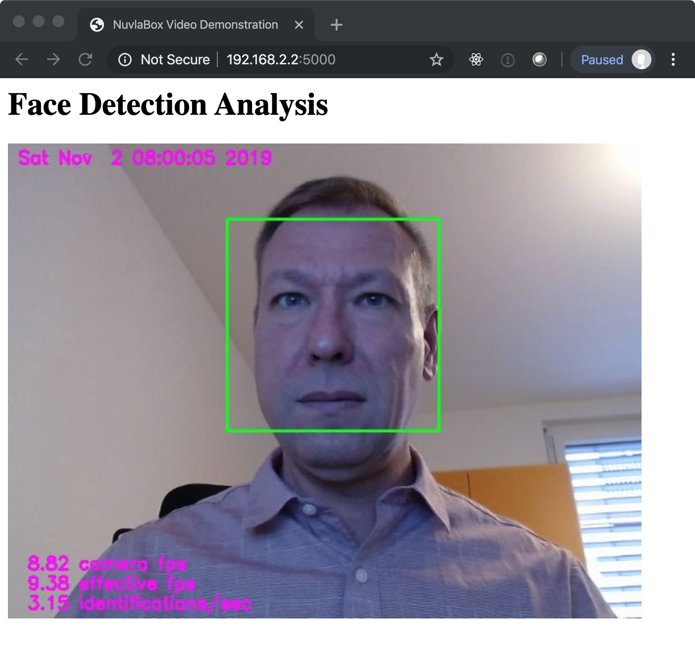

# Sensors

Analyzing sensor data locally provides a number of benefits: reduced
consumption of network bandwidth, mitigation of privacy concerns,
increased protection of attached equipment, and better system
availability through autonomous operation. These benefits are the
strongest motivations for edge computing platforms.

Sensors cover a broad range of devices including video cameras,
microphones, thermometers, pollution detectors, and others. When
linked with actuators, edge computing platforms can provide a central
framework for controlling many localized autonomous systems.

Analysis of data from sensors is often strongly linked with **machine
learning** techniques. In particular, video and audio data is
frequently analyzed using neural networks. Because of limited
computing resources, edge computing devices are _not_ suited to the
_training phase_ of machine learning. This task is better left to
large, centralized data centers. However, running the trained kernel
in the _inference phase_ is well within the capabilities of edge
devices.

To demonstrate how sensor data can be analyzed, you will attach a
webcam to the Raspberry Pi and then analyze the video feed using
OpenCV (open computer vision). The application you deploy identifies
faces within the video feed.

## Application Overview

The demonstration application can be found in the
[loomis/example-opencv](https://github.com/loomis/example-opencv)
GitHub repository. The image is published in the
[clomps/example-opencv](https://cloud.docker.com/u/clomps/repository/docker/clomps/example-opencv)
repository on Docker Hub. This is a multi-architecture image that
supports the amd64, arm, and arm64 instruction sets.

The two core parts of the application are the application web server
in `app.py` and the video analysis in `camera.py`.

The application web server uses the Python Flask framework. It
provides several URLs to expose the video analysis information, along
with the video stream itself. By default, the server runs on the port
5000, although this can be mapped to a different one. The
configuration parameters are provided through four command line
arguments. (See the `get_parameters()` function and the `Dockerfile`.)

The real work happens within the `camera.py` file. OpenCV is used to
identify faces within the video feed (see the `identify_faces()`
function) and then to display an annotated version of the video feed.

## Running the Demo

Log into your RPi and verify that the file `/dev/video0` does _not_
exist. Then plug in the webcam. Check again for the file
`/dev/video0`. This file represents the video feed from the webcam and
should now exist.

While logged into your RPi, you need to launch the demo
application. You must attach the device `/dev/video0` to the container
and expose the port 5000.

```
docker run -d \
       -p 5000:5000 \
       --device /dev/video0:/dev/video0 \
       clomps/example-opencv
```

The image is rather large, so it may take some time to download.

After the container has been started, open the URL
`http://YOUR_RPI_IP:5000`, replacing YOUR_RPI_IP with your IP
address. The webcam should become active and you should see something
similar to the following screenshot.



The statistics show the video frame rates and the number of face
identifications per second. The yellow box shows the location in the
video feed of the identified face.

Although not the main thrust of this course, you might experiment with
the application to see its limitations:

 - Does it work equally well for people with or without beards, facial
   coverings, etc.?

 - What happens if some of your facial features are covered? 

 - Does it identify multiple faces in the image at the same time?

 - How well does it work if you are not directly facing the camera?

 - Does it work differently for still photos or drawings of people
   rather than live subjects?

Limitations in facial recognition can usually be overcome, but it
takes careful selection of the training sample and optimization of the
network topology.

## Modifications

This simple application has many defects that would prevent it from
being used in production. Some of these include:

 * The image is very large and takes time to download. Could this
   image be made smaller?

 * Providing the configuration parameters through the command line is
   not very convenient for Dockerized applications. How could this be
   changed to use environmental variables instead?

 * The application provides the full video stream. Although good for a
   demo, this would waste valuable network bandwidth in
   production. Could you modify the application to just send
   notifications when a face is identified? Possibly with the
   identified face?

 * What would need to change if you wanted to analyze audio rather
   than video?

 * How would you perform an action based on the analysis. For example,
   beep everytime a face is detected?  How is this different than
   showing a message in the log or sending a notification? 

You will have a chance later in the course to implement some of these
modifications. But you should already start thinking about how you
would go about implementing them.
