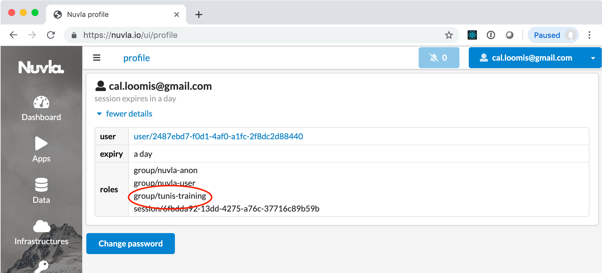
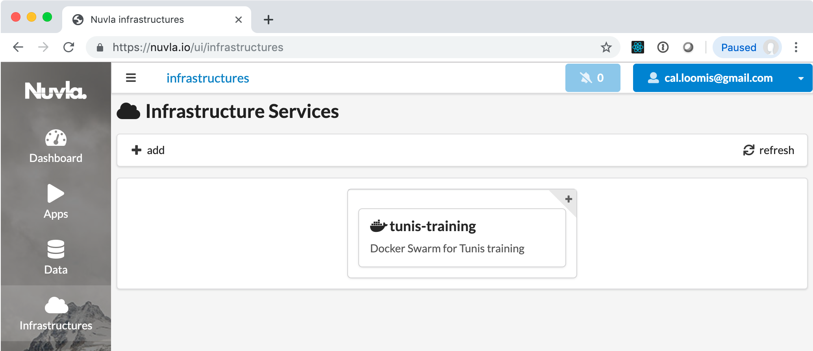
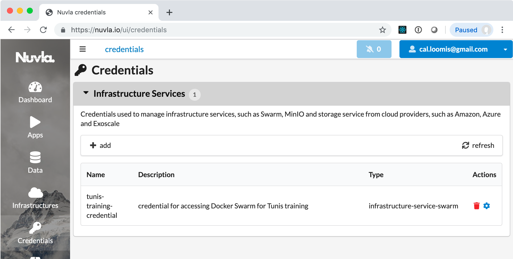
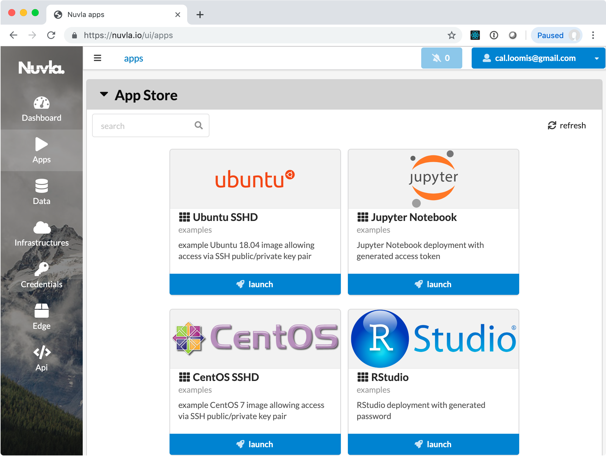

# Exercises

In these exercises, you will first use the nuvla.io service to deploy
applications into a shared Docker Swarm cluster, showing how
applications can be deployed through this service to cloud
infrastructures.

You will then create a simulated edge device, register this with
nuvla.io, and then deploy applications into the device, showing how
edge devices can be incorporated into a hybrid infrastructure.

## Setup

Create an account on [nuvla.io](https://nuvla.io). Let your instructor
know when you have created your account, so that you can be added to
the appropriate group.

## Sanity Checks

After you have been added to the group, log out and log back in to
nuvla.io. When you are logged in, verify that you have the role
"group/tunis-training" in your session. Click on your username in the
upper, right-hand corner to see your session information.

## Cloud Applications

On nuvla.io, navigate to the "Infrastructures" by clicking on the icon
in the menu bar on the left. You should see a Docker Swarm
infrastructure ("tunis-training") that has been deployed for this
training. This is a 3-node [Docker Swarm
cluster](https://nuv.la/module/apps/Containers/docker-swarm/swarm)
that has been deployed via SlipStream on nuv.la to Exoscale.  Clicking
on the card, will show the details for the Docker Swarm cluster.

Similarly, you should also see a credential that is linked to this
infrastructure and that grants you access.  Click on the "Credentials"
link on the left.

Navigate to the "Apps" section. Here you will find a number of
applications that can run on the cloud or in edge devices. Try
deploying some of these applications to be sure that they work.

Clicking "launch" will start the application and redirect you to the
"Dashboard" section. Click on the card for more details on any
deployment. You can control the application with the stop/trash icons
or action links when they appear.

Most applications will provide a direct link to the application, which
will appear at the bottom of the card in green. 

The applications to try are:

 - Ubuntu SSHD: Provide your SSH key so that you can log into the
   container.

 - CentOS SSHD: Provide your SSH key so that you can log into the
   container.

 - RStudio: Log in to the deployed application using "rstudio" as the
   username and by getting the password value from the details
   page.

 - Jupyter Notebook: Just clicking the link should take to you the
   Jupyter console. 

 - RabbitMQ: You can log into the management console by using
   "guest/guest". You might look at some of the other links provided.

 - My first application: This shows how a full, multi-component
   application can be defined. It also shows how Docker configs,
   secrets, and environmental variables can be used.

 - Video Analysis Demo: This requires a video camera attached to a
   physical NuvlaBox.  This application won't work here.

After you've deployed some of these applications, verify that you can
also stop and clean up the applications.

## NuvlaBox

You will now create a (virtual) NuvlaBox to show how edge devices are
registered with the system and how applications can be deployed to
those devices.

 1. Log into test.nuvla.io.
 
 1. Navigate to the "edge" section of the UI. 

 1. Click on "add" and then on "NuvlaBox" in the dialog.  This creates
    a new nuvlabox resource.

 1. Click on "Copy your NuvlaBox ID". 

 1. Log into nuv.la. 

 1. Navigate to the [virtual 
    NuvlaBox](https://nuv.la/module/apps/Containers/docker-swarm/nuvlabox)
    component.

 1. Deploy this component with "nuvla.io" in the `nuvla_host` field
    and with your nuvlabox id in the `nuvlabox_id` field.

 1. Follow the deployment, both on nuv.la and on the "edge" page on
    nuvla.io. You can also see the details by clicking on the NuvlaBox
    id. 

 1. When the deployment reaches the "Ready" state, you should see that
    the nuvlabox is in the "COMMISSIONED" state.

At this point, you should be able to deploy applications to the
NuvlaBox. Do that and verify that they work.

You can remove a NuvlaBox by "decommissioning" it. Click on the
appropriate icon/action. **NOTE: This currently fails because of a bug
that will be fixed shortly.**  Afterwards, you can terminate the
virtual NuvlaBox with nuv.la.

