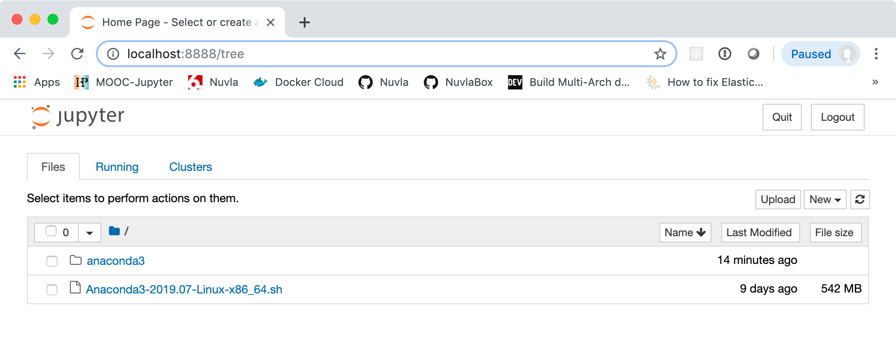

# Applications

After the previous exercises, you understand how to create virtual
machines and store data as objects on the cloud. Although being able
to allocate resource dynamically is a clear benefit, a VM with a
minimal operating system by itself isn't very useful. To really
benefit, the VMs need to be transformed into useful transient or
permanent services.

As examples, you will create a web server with nginx, a standalone
Docker machine, and a standalone Anaconda server.  Afterwards, the
last two will be transformed into multi-VM clusters.

The descriptions below use a Ubuntu 18.04 VM. However, the exercises
can also be completed on CentOS 7 or another Linux distribution.  The
process in all cases is identical, but you will need to adjust some of
the details for the operation system you choose.

## Web Server

If you followed the exercises for system administration, you will
already know how to install a web server and check that it is
running. An abbreviated version of the process for Ubuntu 18.04 is
repeated here:

 - Start and log into an Ubuntu 18.04 VM
 - Update APT cache: `apt update`
 - Install nginx: `apt install -y nginx`
 - Ensure it is enabled: `systemctl enable nginx`
 - Ensure it is started: `systemctl start nginx`

At this point, the command `curl http://localhost` should print out
the raw HTML home page.

Ensure that you can also see the home page from outside of the machine
by visiting the URL "http://ipv4-address".  You can find the IPv4
address from Exoscale or by using the command `ifconfig` inside the
machine.

If you **cannot** see the home page from outside of the machine,
check:

 - The security group is properly configured to allow access on port
   80 (HTTP).  You'll probably also want port 443 (HTTPS), although
   not technically necessary here.

 - The firewall on the VM is not blocking network traffic. The easiest
   is to disable the firewall `systemctl stop ufw`.

If the page is not visible even after checking these points, ensure
that nginx is running and not showing any errors (try
`journalctl`). You can also take a look at the nginx log files:
`/var/log/nginx/{access,error}.log`.

Find and look through the nginx configuration. Nginx follows the usual
convention and puts its configuration into the directory `/etc/ngins`.

Can you find the configuration for the default "site" and the location
of the default home page?

Edit the existing home page to make sure that changes are visible
through the web server.  (If you didn't find it in the configuration,
the root of the default web server is `/var/www/html`.)

You can go further and try replacing the default "site" with your own
"site" configuration. You'll need to understand the layout of the
nginx configuration and how sites are created. 

## Docker

Docker is a container management system that is very popular with
developers and system administrators alike. Although an
oversimplification, containers can be viewed as lightweight "virtual
machines" that start and stop in seconds. The Docker Hub contains a
large number of pre-built images for common services, avoiding the
need for manual software installation.

You will install the Docker system on an Ubuntu 18.04 virtual machine
and ensure that it can be used locally. Details on Docker, including
remote access, will be provided later in the course.

The process for deploying Docker is very similar to deploying nginx.

 - Start and log into an Ubuntu 18.04 VM
 - Update APT cache: `apt update`
 - Install Docker: `apt install -y docker`
 - Ensure it is enabled: `systemctl enable docker`
 - Ensure it is started: `systemctl start docker`

As a sanity check, try to list the running Docker containers:

```
$ docker container ls
CONTAINER ID        IMAGE               COMMAND             CREATED             STATUS             PORTS               NAMES
```

The command worked and provides an empty list of the currently running
containers.  As you've not started any containers, this is normal.

Now run the "hello world" container:

```
$ docker run hello-world 

Unable to find image 'hello-world:latest' locally
latest: Pulling from library/hello-world
1b930d010525: Pull complete 
Digest: sha256:6540fc08ee6e6b7b63468dc3317e3303aae178cb8a45ed3123180328bcc1d20f
Status: Downloaded newer image for hello-world:latest

Hello from Docker!
This message shows that your installation appears to be working correctly.

To generate this message, Docker took the following steps:
 1. The Docker client contacted the Docker daemon.
 2. The Docker daemon pulled the "hello-world" image from the Docker Hub.
    (amd64)
 3. The Docker daemon created a new container from that image which runs the
    executable that produces the output you are currently reading.
 4. The Docker daemon streamed that output to the Docker client, which sent it
    to your terminal.

To try something more ambitious, you can run an Ubuntu container with:
 $ docker run -it ubuntu bash

Share images, automate workflows, and more with a free Docker ID:
 https://hub.docker.com/

For more examples and ideas, visit:
 https://docs.docker.com/get-started/
```

Your output should be nearly identical to the above result.  Again,
the details of docker will be covered later, but here's a short
summary of what happened:

 - Docker searches in the local cache for the "hello-world" image and
   doesn't find it.
 - Docker pulls (downloads) the image "library/hello-world" from
   [Docker Hub](https://hub.docker.com).
 - Docker runs the image, which then spits out the rest of the
   output.

Let's be a bit more ambitious and try to run a container containing
nginx:

```
$ docker run -d -p 80:80 nginx 

Unable to find image 'nginx:latest' locally
latest: Pulling from library/nginx
f5d23c7fed46: Pull complete 
918b255d86e5: Pull complete 
8c0120a6f561: Pull complete 
Digest: sha256:eb3320e2f9ca409b7c0aa71aea3cf7ce7d018f03a372564dbdb023646958770b
Status: Downloaded newer image for nginx:latest
fad3a290dd77a2dcbb4d55249da34e9f71037e033e6d67183e93b3864f4ccd04
```

Again, Docker has downloaded the image from the hub and ran it.  The
`-d` option runs the container as a daemon. The command returns, but
the container is running in the background. You can see this with:

```
$ docker container ls

CONTAINER ID        IMAGE               COMMAND                  CREATED             STATUS              PORTS                NAMES
fad3a290dd77        nginx               "nginx -g 'daemon of…"   9 seconds ago       Up 7 seconds        0.0.0.0:80->80/tcp   thirsty_hertz
```

You can check that the webserver is running by visiting
"http://ipv4-address". You should see the familiar nginx welcome
page.

To stop the container, execute `docker container rm fad3a290dd77`,
where the last argument is the container ID. Verify that the web
server is no longer there (both from docker and from a browser).

## Anaconda

Anaconda is platform that supports data science and data science
collaboration. You will deploy anaconda onto an Ubuntu 18.04 virtual
machine and ensure that it starts.

[Installation information for
Linux](https://www.anaconda.com/distribution/#linux) can be found on
the anaconda website. It will instruct you to download an installer
script and run it.

Assuming that you've deployed an Ubuntu 18.04 VM and are logged into
it **as the ubuntu user**, the installation process is:

```
# download installation script
wget -nd https://repo.anaconda.com/archive/Anaconda3-2019.07-Linux-x86_64.sh

# make it executable
chmod a+x *.sh

# run it
./Anaconda3-2019.07-Linux-x86_64.sh
```

You'll need to respond to a few questions to complete the
installation. Once the installation is complete, you can test that the
installation worked.

Logout and log back into the machine. When you start a python
interpreter, it should contain a reference to anaconda:

```
(base) ubuntu@anaconda:~$ python 
Python 3.7.3 (default, Mar 27 2019, 22:11:17) 
[GCC 7.3.0] :: Anaconda, Inc. on linux
Type "help", "copyright", "credits" or "license" for more information.
>>> 
```

A Jupyter notebook can be started with the command:

```
$ jupyter-notebook

[I 20:36:28.436 NotebookApp] Writing notebook server cookie secret to /home/ubuntu/.local/share/jupyter/runtime/notebook_cookie_secret
[I 20:36:28.807 NotebookApp] JupyterLab extension loaded from /home/ubuntu/anaconda3/lib/python3.7/site-packages/jupyterlab
[I 20:36:28.808 NotebookApp] JupyterLab application directory is /home/ubuntu/anaconda3/share/jupyter/lab
[I 20:36:28.810 NotebookApp] Serving notebooks from local directory: /home/ubuntu
[I 20:36:28.810 NotebookApp] The Jupyter Notebook is running at:
[I 20:36:28.810 NotebookApp] http://localhost:8888/?token=3cd85d84cc1fb0a7c91f092411bb0487cb9c2aca013265a9
[I 20:36:28.810 NotebookApp]  or http://127.0.0.1:8888/?token=3cd85d84cc1fb0a7c91f092411bb0487cb9c2aca013265a9
[I 20:36:28.810 NotebookApp] Use Control-C to stop this server and shut down all kernels (twice to skip confirmation).
[W 20:36:28.816 NotebookApp] No web browser found: could not locate runnable browser.
[C 20:36:28.816 NotebookApp] 
    
    To access the notebook, open this file in a browser:
        file:///home/ubuntu/.local/share/jupyter/runtime/nbserver-14046-open.html
    Or copy and paste one of these URLs:
        http://localhost:8888/?token=3cd85d84cc1fb0a7c91f092411bb0487cb9c2aca013265a9
     or http://127.0.0.1:8888/?token=3cd85d84cc1fb0a7c91f092411bb0487cb9c2aca013265a9

```

**The notebook will only be accessible from the localhost; it will not
be directly accessible over the network.** One method to make it
accessible from your laptop (or local virtual machine) is to create an
SSH tunnel.

From a terminal on your laptop, create the SSH tunnel with the
command:

```
$ ssh -N -L 8888:localhost:8888 ubuntu@vm-ipv4-address
Warning: Permanently added '185.19.29.228' (ECDSA) to the list of known hosts.
```

This command will not return; it is maintaining the open tunnel from
your laptop to the remote machine. You can now access the notebook on
the given URLs from your laptop.



To clean up, you need to cancel (control-C) the SSH tunnel and the
remote Jupyter notebook. Terminate the virtual machine if your done
testing anaconda.

