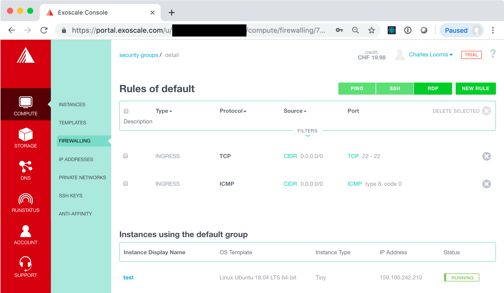

# Compute Lifecycle (Revisited)

In this exercise, you will revisit the compute lifecycle. This time
you will add the SSH key configuration to your VM and access the
deployed instance with SSH.

In the process of doing this, you will also learn about security
groups and how they affect access to your VMs.

## Create a VM

Return to the "COMPUTE/INSTANCES" tab, and click on the "ADD" button.

In the form for creating a new VM, you will repeat what you did
before, **except that you must be sure that an SSH key pair is
selected**.


If you set the key pair you created as the default, it will already be
selected. If not, you must select it manually.

Before creating the VM, take a look at the warning next to the
security group: 


This will cause problems with accessing the VM. Will we address this
problem after creating the VM.

Now click on "CREATE" to create a new VM. Wait until the machine
reaches the running state before moving on to the next part of the
exercise.

## Ping the Machine

Once the machine is started, you will be able to see its IPv4
address.  Try pinging this address and logging into the machine with
SSH.

```
$ ping 159.100.242.210 
PING 159.100.242.210 (159.100.242.210): 56 data bytes
Request timeout for icmp_seq 0
Request timeout for icmp_seq 1
Request timeout for icmp_seq 2
Request timeout for icmp_seq 3
Request timeout for icmp_seq 4
Request timeout for icmp_seq 5
Request timeout for icmp_seq 6
^C
--- 159.100.242.210 ping statistics ---
8 packets transmitted, 0 packets received, 100.0% packet loss
```

```
$ ssh ubuntu@159.100.242.210 
ssh: connect to host 159.100.242.210 port 22: Operation timed out
$
```

The above shows that both commands fail; the machine cannot be reached
via ping (ICMP) or SSH. 

## Security Groups

Security groups act as dynamic firewalls around your VMs. You can
define multiple security groups and also assign multiple groups to a
single VM.

Look at the details for the "default" security group which is used for
the running VM. Go to the "COMPUTE/FIREWALLING" tab in the Exoscale
portal and from there click on the "default" link (title of the
security group).

You should see something similar to the following screenshot.


There are no rules in this group, so **no network traffic can reach the
VM!** This clearly isn't useful in this case.  We need rules for at
least SSH and PING.  Use the buttons at the top to create those two
rules.



For other services, you will want to add other rules.  These can be
added with the "NEW RULE" button. That will be covered later when we
add more services to a VM.

## Access the VM

Now try to ping the machine again.

```
$ ping 159.100.242.210 
PING 159.100.242.210 (159.100.242.210): 56 data bytes
64 bytes from 159.100.242.210: icmp_seq=0 ttl=47 time=124.364 ms
64 bytes from 159.100.242.210: icmp_seq=1 ttl=47 time=94.815 ms
64 bytes from 159.100.242.210: icmp_seq=2 ttl=47 time=96.981 ms
64 bytes from 159.100.242.210: icmp_seq=3 ttl=47 time=91.871 ms
64 bytes from 159.100.242.210: icmp_seq=4 ttl=47 time=134.510 ms
^C
--- 159.100.242.210 ping statistics ---
5 packets transmitted, 5 packets received, 0.0% packet loss
round-trip min/avg/max/stddev = 91.871/108.508/134.510/17.462 ms
```

You should see that the machine can be contacted and that there are
reasonable transit times.

Now try again with SSH.

```
$ ssh ubuntu@159.100.242.210 
Warning: Permanently added '159.100.242.210' (ECDSA) to the list of known hosts.
Welcome to Ubuntu 18.04.2 LTS (GNU/Linux 4.15.0-50-generic x86_64)

 * Documentation:  https://help.ubuntu.com
 * Management:     https://landscape.canonical.com
 * Support:        https://ubuntu.com/advantage

  System information as of Fri Aug  2 19:32:37 UTC 2019

  System load:  0.0               Processes:           83
  Usage of /:   14.4% of 9.52GB   Users logged in:     0
  Memory usage: 19%               IP address for eth0: 159.100.242.210
  Swap usage:   0%


47 packages can be updated.
0 updates are security updates.


*** System restart required ***
ubuntu@test:~$ exit
logout
Connection to 159.100.242.210 closed.
```

This shows that the machine can be accessed via SSH. Everything works!

> **NOTE**: The VM didn't need to be restarted for the changes to the
> security group to take effect. Changes to security groups are
> applied dynamically!

## Destroy Machine

Now you can destroy the VM, using the same process as you did
earlier. You might want to try the ping and SSH commands again to be
sure that the machine really has disappeared.
